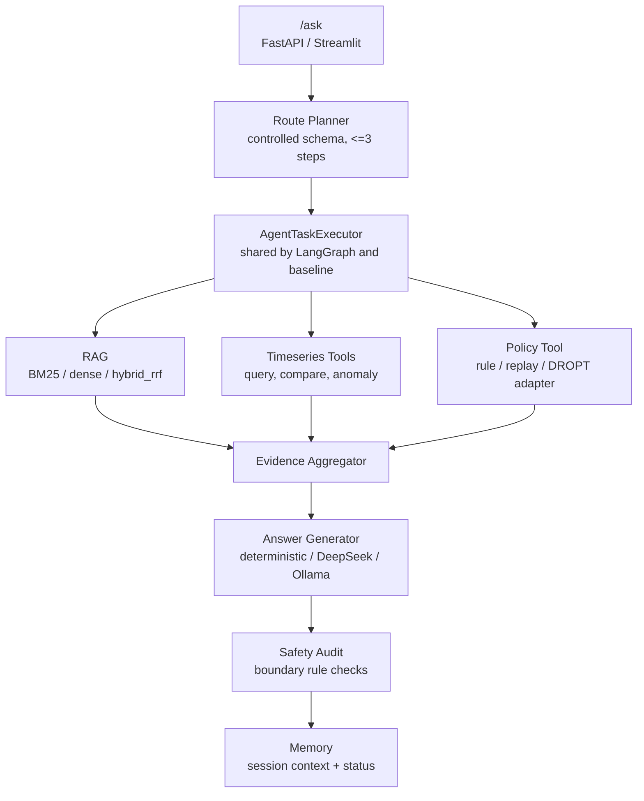
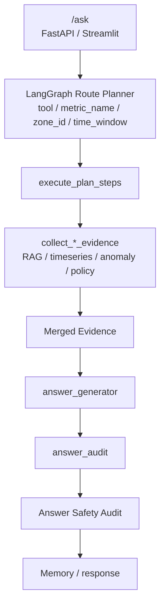

# DataCenter-HVAC Copilot

面向数据中心 HVAC 运维分析的 RAG + Tool Agent：系统基于 BEAR HVAC 仿真轨迹和运维知识文档，完成文档问答、时序查询、异常诊断、策略建议、可复现评测与会话记忆。

[](https://github.com/zwzwzwzwz123/DataCenter-HVAC-Copilot/actions/workflows/ci.yml)




<!-- 截图待补：Streamlit Copilot 主界面 -->


**核心亮点入口**：受控 LLM route planner、共享 executor 的可对照 workflow、`hybrid_rrf` 融合检索、FAISS 知识库原子索引、memory 失败降级与状态暴露。

## 项目亮点

**受控 LLM Route Planner**  
Planner 只允许输出 `document_qa`、`timeseries_query`、`anomaly_diagnosis`、`policy_recommendation` 四类 route，计划长度限制为 1-3 步，工具名和 `time_window` 也经过 schema 校验；如果包含 policy step，必须放在最后。这样把 LLM 用在“任务分解和路由”上，而不是让它自由调用工具或生成控制动作；非法 JSON、非法 route/tool、超长计划或 LLM 调用异常都会回退到 deterministic planner。代码位置：`src/agent/planner.py`。

**LangGraph Workflow 与 Deterministic Baseline 共享 Executor**  
LangGraph 编排和 deterministic baseline 复用同一个 `AgentTaskExecutor`，底层 RAG、时序工具、policy runner、answer audit 不因 workflow 变化而漂移。这个设计让 LangGraph 可以展示多步 trace 和可选 LLM planner，同时 baseline 仍然能作为回归对照；当前 `rag_tool_agent` 与 `langgraph_tool_agent` 在核心 eval 指标上保持一致。代码位置：`src/agent/langgraph_workflow.py`、`src/agent/executor.py`。

**`hybrid_rrf`：BM25 + Dense 的 RRF 融合检索**  
项目中严格区分两个名字相近的检索器：`rag_hybrid` 使用 `HybridRetriever`，实际是 BM25-style lexical retriever；`hybrid_rrf` 使用 `HybridRRFRetriever`，对 BM25 候选和 dense 候选做 Reciprocal Rank Fusion。这样可以在不把分数强行归一化的情况下融合 lexical precision 和 semantic recall，也能把 RRF 作为后续替换 embedding/reranker 的稳定实验入口。代码位置：`src/retrieval/retriever.py`、`src/evaluation/runner.py`。

**持久化知识库的 FAISS 原子索引**  
上传 PDF/DOCX/TXT/MD 后，系统解析为 chunks，元数据进入 SQLite，向量索引用 FAISS + `chunks.jsonl` sidecar + `manifest.json` 持久化。重建索引时先写临时文件，再原子替换正式文件，并在失败时恢复备份；加载时校验 manifest hash、FAISS 行数和 sidecar 行数，避免半写索引返回错误 citation。代码位置：`src/knowledge/indexer.py`、`src/knowledge/retriever.py`。

**Memory 降级不阻断主回答**  
`/ask` 支持 session-scoped conversation memory，但 memory 不是主链路的单点依赖。SQLite、retrieval、indexing、trace persistence 任一环节失败时，API 会在 `memory_status` 和 `workflow_trace` 中分层暴露状态，同时继续完成当前 RAG/tool/policy 回答。代码位置：`src/api/app.py`、`src/memory/context_manager.py`。

## 系统架构

系统不是普通 ChatPDF，而是面向数据中心 HVAC 运维分析的 RAG + Tool Agent。LLM / Agent 只负责任务路由、证据整合和解释生成，不能直接生成或写回控制动作。



Planner 支持 `last_N_hours` 等结构化 `time_window`，非法 `time_window` 会被拒绝或回退；工具结果会暴露 `time_window_applied`，便于调试真实查询窗口。普通单步样本没有 `expected_steps`，多步 `compound_task` 会单独评估 `planned_step_accuracy`、`planned_step_order_accuracy` 和 `policy_final_step_rate`。

## 数据边界

BEAR rollout 是 HVAC 仿真/导出数据，不是真实数据中心生产遥测，不能伪装成真实数据中心生产遥测。真实文档子集使用公开 PDF 和当前 BEAR rollout 做可复现评测，边界和来源见 `docs/data_card.md`；演示脚本和建议讲法见 `docs/demo_walkthrough.md`。

确定性边界审计会用 small adversarial audit 检查“真实生产遥测”“LLM 直接控制”“未验证 policy action”等高风险表述，当前 hit rate 0.586，其中英文/翻译/paraphrase 泛化仍弱。session-scoped SQLite conversation memory 只增强多轮上下文，retrieved context loading 和工具 evidence 仍是当前回答主来源。

## LLM 后端配置

默认路径不需要 API；未配置 DeepSeek/Ollama 时使用 deterministic fallback。可选 LLM route planner 通过环境变量开启：

```bash
LANGGRAPH_PLANNER_PROVIDER=deepseek
LANGGRAPH_PLANNER_MODEL=deepseek-chat
OLLAMA_MODEL=qwen2.5:7b
```

本地 ollama 服务可用于无云端 API 的 planner/answer 生成演示。

`LANGGRAPH_PLANNER_PROVIDER` 只控制 LangGraph planner，实际工具执行仍由共享 `AgentTaskExecutor` 完成。`execute_plan_steps` 会调用 RAG、时序、异常和 policy 工具，`answer_generator` 只解释合并后的证据。需要人审/LLM judge 时可在评测命令中加入 `--enable-llm-judge`。

## LangGraph 工作流追踪演示

LangGraph 现在使用受控 route planner + shared executor，而不是自由形式工具调用。Streamlit Copilot 可以切换 workflow engine 并查看 trace；每一步会显示 route、工具参数、evidence 和最终 answer audit。复合任务评测可通过 `scripts/generate_compound_eval.py` 生成，输出包括 `compound_task_llm_planner_eval.json` 和 `compound_task_llm_planner_eval.md`；当前 `planned_step_accuracy` = 0.780。

## Results

当前主结果使用真实 embedding：`BAAI/bge-small-zh-v1.5` + FAISS。结果分为两组：108 条合成/样例评测集用于规模化回归，50 条真实手写子集用于验证真实公开文档知识库和工具链。真实子集刻意加入难度梯度、相似文档干扰、跨文档整合和文档外边界题，避免任何 baseline 轻松满分。

**检索 baseline**

| Dataset | Mode | Citation / Context | Expected Keyword | Evidence | Correctness Proxy | Faithfulness Proxy |
| --- | --- | ---: | ---: | ---: | ---: | ---: |
| 108 synthetic, demo docs | `rag_dense` | 0.708 | 0.430 | 1.000 | 0.432 | 0.410 |
| 108 synthetic, demo docs | `rag_hybrid` BM25 lexical | 0.523 | 0.295 | 0.620 | 0.344 | 0.328 |
| 108 synthetic, demo docs | `hybrid_rrf` BM25 + dense RRF | 0.708 | 0.402 | 1.000 | 0.454 | 0.432 |
| 50 real, uploaded PDFs | `rag_dense` | 0.562 | 0.309 | 1.000 | 0.148 | 0.148 |
| 50 real, uploaded PDFs | `rag_hybrid` BM25 lexical | 0.781 | 0.400 | 0.760 | 0.191 | 0.191 |
| 50 real, uploaded PDFs | `hybrid_rrf` BM25 + dense RRF | 0.812 | 0.424 | 1.000 | 0.205 | 0.205 |

**Agent workflow**

| Dataset | Mode | Citation / Context | Expected Keyword | Tool Select | Tool Success | Evidence | Correctness Proxy | Faithfulness Proxy | Grounding |
| --- | --- | ---: | ---: | ---: | ---: | ---: | ---: | ---: | ---: |
| 108 synthetic, demo docs | `rag_tool_agent` | 0.338 | 0.628 | 0.882 | 1.000 | 0.917 | 0.541 | 0.486 | 0.477 |
| 108 synthetic, demo docs | `langgraph_tool_agent` | 0.338 | 0.628 | 0.882 | 1.000 | 0.917 | 0.541 | 0.486 | 0.477 |
| 108 synthetic, demo docs | `react_agent` | 0.338 | 0.644 | 0.956 | 1.000 | 0.917 | 0.582 | 0.527 | 0.477 |
| 50 real, uploaded PDFs | `rag_tool_agent` | 0.562 | 0.643 | 0.850 | 1.000 | 1.000 | 0.703 | 0.690 | 0.938 |
| 50 real, uploaded PDFs | `langgraph_tool_agent` | 0.562 | 0.665 | 1.000 | 1.000 | 1.000 | 0.727 | 0.713 | 0.938 |
| 50 real, uploaded PDFs | `react_agent` | 0.562 | 0.648 | 0.900 | 1.000 | 1.000 | 0.713 | 0.700 | 0.938 |

这组结果说明三件事。第一，重构后的 50 条真实子集不再是“系统能答对”的简单集：`hybrid_rrf` citation/context 为 0.812，没有满分，但仍高于纯 dense 的 0.562 和 BM25 lexical 的 0.781，能体现 RRF 融合的增益。第二，在 108 条合成/样例集上，BGE dense 把 `rag_dense` citation/context 从旧 deterministic dense 的 0.508 提升到 0.708，`hybrid_rrf` 从 0.569 提升到 0.708；BM25 不依赖 embedding，因此保持 0.523。第三，真实子集里的时序、异常和策略题需要工具证据，`langgraph_tool_agent` 在真实子集上达到 1.000 tool selection、1.000 tool success、1.000 evidence coverage，整体 correctness proxy 为 0.727。

主要 artifact：

| Artifact | 内容 |
| --- | --- |
| `data/eval/real_bge_demo_docs/baseline_comparison.json` | 108 条合成/样例集，隔离真实知识库后使用 BGE + FAISS 跑 demo docs |
| `data/eval/real_eval_bge/baseline_comparison.json` | 50 条真实手写子集，使用 7 篇上传公开 PDF、340 chunks、BGE + FAISS |
| `docs/data_card.md` | 真实公开文档来源、用途、评测边界和主要结果 |
| `docs/real_eval_log.md` | 本轮真实数据评测的完整实验记录 |

补充结果：

| Artifact | Metric | Value |
| --- | --- | ---: |
| `intent_routing_comparison.json` | rule-based intent accuracy, 100-sample artifact | 0.640 |
| `baseline_comparison.json` | safety adversarial overall hit rate | 0.586 |
| `baseline_comparison.json` | safety translation hit rate | 0.000 |
| `baseline_comparison.json` | DROPT policy benchmark success | 28 / 28 |

## Quick Start

```bash
conda create -n hvac-copilot python=3.12
conda activate hvac-copilot
pip install -e ".[dev]"
```

可选：如果要运行 FAISS / sentence-transformers dense retrieval：

```bash
pip install -e ".[dev,dense]"
```

这会启用本地 FAISS dense retrieval、`rag_dense` 和 `hybrid_rrf`，不需要 API；Qdrant 仍可作为后续可替换向量库。

可选：如果要运行 DROPT / Guided-DiffFNO policy backend：

```bash
pip install -e ".[policy]"
pip install -e ".[dev,policy]"
```

启动 API：

```bash
uvicorn src.api.app:app --reload
```

启动 Streamlit：

```bash
streamlit run app/streamlit_app.py
```

发送一个示例问题：

```bash
curl -X POST http://localhost:8000/ask ^
  -H "Content-Type: application/json" ^
  -d "{\"question\":\"最近 zone_temperature 有没有异常？\",\"workflow_engine\":\"langgraph\"}"
```

运行默认完整评测（使用仓库默认配置）：

```bash
python scripts/run_eval.py
```

使用 BGE-small-zh + FAISS 跑 108 条合成/样例评测：

```bash
pip install -e ".[dev,dense]"
python scripts/run_eval.py --dense-provider sentence-transformers --dense-backend faiss --dense-model BAAI/bge-small-zh-v1.5
```

使用 BGE-small-zh + FAISS 跑 50 条真实文档子集：

```bash
python scripts/run_eval.py --eval-path data/eval/real_eval.jsonl --output data/eval/real_eval_bge/baseline_predictions.jsonl --comparison-output data/eval/real_eval_bge/baseline_comparison.json --report-output data/eval/real_eval_bge/experiment_report.md --human-review-sample-output data/eval/real_eval_bge/human_review_sample.jsonl --human-review-annotations-output data/eval/real_eval_bge/human_review_annotations.jsonl --dense-provider sentence-transformers --dense-backend faiss --dense-model BAAI/bge-small-zh-v1.5
```

如果模型已缓存在本机但 HuggingFace 元数据请求超时，可使用离线模式：

```bash
HF_HUB_OFFLINE=1 TRANSFORMERS_OFFLINE=1 python scripts/run_eval.py --eval-path data/eval/real_eval.jsonl --dense-provider sentence-transformers --dense-backend faiss --dense-model BAAI/bge-small-zh-v1.5
```

Docker 本地演示：

```bash
docker compose up --build
```

Docker 一键启动支持 fresh clone，本地不要求预先创建 `.env`。Compose 会启动 API 和 Streamlit，前端通过 `HVAC_COPILOT_API_BASE_URL` 指向后端服务。

如需配置 DeepSeek/Ollama，可先复制 `.env.example` 到 `.env` 并填入对应变量；未配置时系统使用 deterministic fallback。

## Design

**把 LLM 放在受控边界内**  
系统允许 LLM 做 route planning 和 evidence-grounded answer generation，但不允许 LLM 直接写回控制动作。Planner 输出先经过 schema 校验，policy recommendation 由 policy tool 产生，answer generator 只解释 evidence 和 tool result。这个边界让 demo 更接近工程系统：可解释、可回退、可评测。

**把 workflow 编排和工具执行解耦**  
LangGraph 负责多步流程、trace 和 planner 接入；`AgentTaskExecutor` 负责实际工具行为。这样 workflow 可以迭代，评测仍能用 deterministic baseline 发现行为漂移，也便于把 agent 编排问题和工具正确性问题分开调试。

**把检索实验命名为可验证 baseline**  
`rag_keyword`、`rag_hybrid`、`hybrid_rrf`、`rag_hybrid_rerank` 分别对应不同 retriever / wrapper，而不是把所有检索都写成“hybrid”。这种命名降低了 README 和代码之间的语义风险，也让评测表能直接回答“哪个检索改动真的带来收益”。

**把知识库索引视为可恢复状态**  
SQLite 是 document/chunk metadata 的 source of truth，FAISS 是可重建索引。manifest、hash、sidecar 行数校验和原子替换让索引更新失败时保持旧索引可用，适合面向上传文档的 demo，而不是只在进程内维护一次性向量。

**把 memory 作为增强上下文，而不是主回答依赖**  
Memory 用于多轮指代、历史解释和 evidence refs，但当前问题的新鲜 RAG/tool/policy evidence 仍是回答主来源。API 分层返回 storage、retrieval、indexing、trace persistence 状态，让调用方知道 memory 是否参与了本轮回答。

## Scope & Limitations

系统使用 BEAR HVAC 仿真 rollout 和样例文档展示数据中心冷却分析流程，不把 BEAR 表述为真实生产遥测。这样做是为了在可复现环境里验证 RAG、tool use、policy boundary 和 eval pipeline。

评测以 deterministic metrics 和 proxy metrics 为主，包含 citation/context、tool selection/execution、evidence coverage、keyword coverage、correctness/faithfulness proxy。项目预留 human review 文件和 LLM judge adapter，但当前主结果不声称来自人工评审。

Safety audit 是关键词/规则审计，用于暴露“真实生产遥测”“LLM 直接控制”“未验证 policy action”等边界风险。当前 adversarial hit rate 为 0.586，其中 translation 类为 0.000，说明英文/翻译表达泛化弱；它是边界检查器，不是完整安全防护系统。

真实文档子集当前绑定的是上传后生成的 `document_id`。这些 ID 由 UUID 生成，不是内容 hash；如果删除并重新上传同一批 PDF，`required_documents` 需要同步更新。后续更稳的做法是让 citation metric 支持按文件名或 file hash 匹配。

## Project Structure

```text
src/agent/        planner, LangGraph workflow, shared executor, answer generator, audit
src/api/          FastAPI app, schemas, demo factory
src/retrieval/    keyword, BM25 lexical, dense, FAISS, RRF, rerank, query rewrite
src/knowledge/    upload parsing, SQLite metadata, FAISS indexer/retriever/service
src/memory/       SQLite conversation memory, retrieval, indexing, context budget
src/tools/        BEAR-like time-series query, compare, anomaly, energy breakdown
src/policies/     rule-based, offline replay, MPC-like, diffusion/DROPT adapters
src/evaluation/   dataset loader, metrics, baseline comparison, reports, judge hooks
src/ingestion/    BEAR schema, sample loader, processed rollout loader
app/              Streamlit demo
scripts/          eval, intent eval, compound eval generation, BEAR export
data/eval/        eval JSONL and current comparison artifacts
data/documents/   demo RAG documents
data/knowledge/   uploaded real documents, SQLite metadata, parsed text, FAISS index
docs/             experiment report, real eval log, data card
```

## Evaluation Details

当前评测集包含 108 条样例，对应 108 条 JSONL 评测集：

```text
document_qa:          40
timeseries_query:     20
anomaly_diagnosis:    20
policy_recommendation:28
```

默认完整评测：

```bash
python scripts/run_eval.py
```

该命令会生成：

```text
data/eval/baseline_predictions.jsonl
data/eval/baseline_comparison.json
docs/experiment_report.md
data/eval/human_review_sample.jsonl
data/eval/human_review_annotations.jsonl
```

当前默认 artifact 的核心数字：

```text
tool_selection_accuracy        = 0.882
evidence_coverage              = 0.917
expected_keyword_coverage      = 0.628
answer_correctness_proxy       = 0.541
faithfulness_proxy             = 0.486
langgraph_tool_agent tool_selection_accuracy      = 0.882
langgraph_tool_agent evidence_coverage            = 0.917
```

Query Rewrite / HyDE baselines 也包含在 comparison artifact 中：`rag_rewrite` 使用 deterministic query expansion，`rag_hyde` 和 `rag_hyde_rerank` 用于检验假设性答案扩展和 rerank 的收益。

108 条合成/样例集的 BGE + FAISS 对照：

```bash
python scripts/run_eval.py \
  --output data/eval/real_bge_demo_docs/baseline_predictions.jsonl \
  --comparison-output data/eval/real_bge_demo_docs/baseline_comparison.json \
  --report-output data/eval/real_bge_demo_docs/experiment_report.md \
  --human-review-sample-output data/eval/real_bge_demo_docs/human_review_sample.jsonl \
  --human-review-annotations-output data/eval/real_bge_demo_docs/human_review_annotations.jsonl \
  --dense-provider sentence-transformers \
  --dense-backend faiss \
  --dense-model BAAI/bge-small-zh-v1.5
```

50 条真实手写子集的 BGE + FAISS 对照：

```bash
python scripts/run_eval.py \
  --eval-path data/eval/real_eval.jsonl \
  --output data/eval/real_eval_bge/baseline_predictions.jsonl \
  --comparison-output data/eval/real_eval_bge/baseline_comparison.json \
  --report-output data/eval/real_eval_bge/experiment_report.md \
  --human-review-sample-output data/eval/real_eval_bge/human_review_sample.jsonl \
  --human-review-annotations-output data/eval/real_eval_bge/human_review_annotations.jsonl \
  --dense-provider sentence-transformers \
  --dense-backend faiss \
  --dense-model BAAI/bge-small-zh-v1.5
```

真实子集依赖当前 `data/knowledge/` 中的 7 篇已上传 PDF 和对应 document IDs。完整来源、许可说明和边界见 `docs/data_card.md`；实验过程见 `docs/real_eval_log.md`。

覆盖率命令：

```bash
python -m pytest --cov=src --cov-report=term-missing -q
```

本地当前一次运行的核心模块覆盖率约 88%。`policy` extra / `torch` 相关测试可能因未安装 `torch` 被跳过。

评测口径：当前 README 报告 deterministic proxy 指标，预留人审接口和模板，`human_review_annotations.jsonl` 初始状态为 human review pending。人工校准流程见 Human Calibration 指南 `docs/human_evaluation_guide.md`。

Intent routing 单独评测：

```bash
python scripts/run_intent_eval.py --providers rule_based
```

当前 `intent_routing_comparison.json` 是 100-sample artifact；如果要和 108 条主评测集完全对齐，需要重新运行并更新 artifact。

## BEAR Export

仓库已包含 `data/bear_processed/bear_rollout.csv`，demo 会优先加载该 processed CSV；若不存在，再回退到 `BEAR/BEAR/Data/Exercise2A-mytest.csv`，最后使用内置 mock trajectory。

如需从外部 BEAR 仓库重新导出 rollout：

```bash
git clone https://github.com/chz056/BEAR.git ../BEAR
pip install -r ../BEAR/requirements.txt
python scripts/export_bear_data.py --bear-root ../BEAR --num-steps 336 --scenario-id bear_officesmall_tucson_14d_random --output data/bear_processed/bear_rollout.csv
```

导出的字段遵循 BEAR state layout：

```text
[zone_temperature(n), outdoor_temp(1), solar_irradiance/GHI(n), ground_temp(1), occupancy_power(n)]
```

## Resume One-Liner

构建 DataCenter-HVAC Copilot：基于 BEAR HVAC 仿真轨迹和 7 篇真实公开数据中心文档实现 RAG + Tool Agent + LangGraph workflow，包含 BGE-small-zh + FAISS 知识库、`hybrid_rrf` BM25+dense RRF 融合检索、受控 LLM route planner、共享 `AgentTaskExecutor` 的 baseline/LangGraph 可对照评测与 session memory 降级机制；评测覆盖 108 条合成/样例集和 50 条真实手写子集，真实子集通过相似文档干扰、跨文档整合和边界题制造区分度，`hybrid_rrf` citation/context 为 0.812，高于 BM25 的 0.781 和纯 dense 的 0.562，`langgraph_tool_agent` tool selection / success / evidence coverage 达到 1.000 / 1.000 / 1.000。
