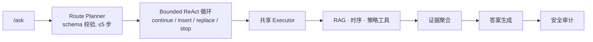

# DataCenter-HVAC Copilot

面向数据中心 HVAC 运维分析的检索增强 **工具型 Agent**。系统基于运维文档和 HVAC 仿真遥测回答问题：先规划一段简短的工具序列，再收集证据（文档检索、时序分析、策略查询），最后生成有据可依的解释。语言模型只负责规划和解释，不直接产生控制动作——每一次工具调用都由本地 runtime 校验和执行。

[](https://github.com/zwzwzwzwz123/DataCenter-HVAC-Copilot/actions/workflows/ci.yml)


## 概述

系统接到问题后，先经受控 planner 拆解为至多五步计划，再进入 bounded ReAct 循环——它可以在本地 guardrail 允许的范围内动态增删证据步骤——随后针对 RAG / 时序 / 策略工具执行计划，聚合证据，生成答案，并交由确定性安全审计检查。整条链路可追踪、在语言模型不可用时优雅回退，并有可复现的评测基准。



## 功能

- **受控 route planner。** Planner 只输出四类 route（`document_qa`、`timeseries_query`、`anomaly_diagnosis`、`policy_recommendation`），且经过 schema 校验——计划长度 1–5 步，工具名和 `time_window` 都受校验，policy step 必须放在最后。非法 JSON、未知 route、超长计划或语言模型异常都会回退到确定性 planner。（`src/agent/planner.py`）
- **Bounded ReAct 循环。** 初始计划之后，controller 每轮只能选择 `continue_next_step`、`insert_step`、`replace_next_step`、`stop_and_answer` 或 `stop_blocked`。每个动作都经过本地校验：route/tool 白名单、五步预算、非相邻重复工具拦截、input signature 去重、policy 必需步骤保护，以及 policy deadline guard。（`src/agent/bounded_react.py`）
- **跨 workflow 共享 executor。** 确定性 baseline、LangGraph workflow 和 bounded ReAct 循环共用同一个 `AgentTaskExecutor`，因此工具行为不会随编排策略漂移，baseline 也可以作为回归对照。（`src/agent/executor.py`）
- **Runtime trace、hook 与恢复机制。** 每次 run 返回 `todos` 和 `runtime_trace`，涵盖任务状态流转、`PreToolUse` / `PostToolUse` / `RunComplete` hook、control boundary approval，以及 tool retry、query rewrite retry、policy fallback 等恢复事件。审批被拒绝时不会写入有效的 `policy_result`。（`src/agent/runtime.py`）
- **RRF 融合检索。** `hybrid_rrf` 通过 reciprocal rank fusion 融合 BM25 与 dense 候选，无需强行归一化分数；可选的 cross-encoder 作为第二阶段对融合候选做精排。（`src/retrieval/retriever.py`）
- **可恢复的知识索引。** 上传的 PDF/DOCX/TXT/MD 被解析为 chunks，元数据存入 SQLite，向量存入 FAISS 索引。重建时先写临时文件再原子替换，加载时校验 manifest hash 和行数，避免半写索引返回错误 citation。（`src/knowledge/indexer.py`）
- **会话记忆作为增强。** 会话记忆用于丰富多轮上下文，但绝不是单点依赖；API 会分层暴露 storage、retrieval、indexing、trace persistence 的状态，同时仍从新鲜证据生成回答。（`src/memory/context_manager.py`）
- **Planner 决策 SFT 蒸馏（本地小模型）。** 用 700 条经守卫校验的**人工 gold**，把线上 route planner 的结构化决策能力监督微调进一个本地 1.5B 小模型（Qwen2.5-1.5B-Instruct + QLoRA）。训练与推理复用同一套 prompt 构造与解析函数，产出的 `DistilledRoutePlanner` 与线上 planner 同 protocol、零格式漂移。四方评测中本地小模型达 84% step_acc，反超作为对照基线的云端 DeepSeek planner。详见 [Planner 决策蒸馏（SFT）](#planner-决策蒸馏sft)。（`distill/`）

## 安装

```bash
conda create -n hvac-copilot python=3.12
conda activate hvac-copilot
pip install -e ".[dev]"
```

可选依赖：

```bash
pip install -e ".[dev,dense]"    # FAISS + sentence-transformers dense 检索
pip install -e ".[policy]"       # DROPT / diffusion policy 后端（研究型 adapter）
pip install -e ".[train]"        # SFT 蒸馏训练（torch / transformers / trl / peft，GPU 环境）
```

默认路径不需要任何 API key，全程使用确定性回退。

## 使用

启动 API 或 Streamlit 前端：

```bash
uvicorn src.api.app:app --reload
streamlit run app/streamlit_app.py
```

发送一个问题。`workflow_engine` 可选 `deterministic`、`langgraph`、`bounded_react_guard`、`bounded_react`、`bounded_react_batch`：

```bash
curl -X POST http://localhost:8000/ask \
  -H "Content-Type: application/json" \
  -d '{"question": "先检查最近的 zone 温度，再给出策略建议。", "workflow_engine": "bounded_react"}'
```

返回内容包含 `workflow_trace`（planner / execution / audit）、`todos`、`runtime_trace`（hooks、approvals、recoveries）和 `react_trace`。

## 配置

系统默认不需要任何语言模型后端。若要启用可选的 LLM answer generator、route planner 和 bounded ReAct controller，将 `.env.example` 复制为 `.env` 并设置：

```bash
DEEPSEEK_API_KEY=sk-...
LLM_PROVIDER=deepseek                        # answer generator
LANGGRAPH_PLANNER_PROVIDER=deepseek          # route planner
BOUNDED_REACT_CONTROLLER_PROVIDER=deepseek   # ReAct controller
OLLAMA_MODEL=qwen2.5:7b                       # 本地，无需云端 API
```

无论使用哪种后端，工具执行始终由共享 `AgentTaskExecutor` 完成，answer generator 只解释聚合后的证据。

## 评测

结果在两个独立评测集上报告。检索与 Agent 回答质量使用 50 条手写子集，背后是 7 篇公开 PDF（340 chunks），配合真实 embedding（BGE-small-zh + FAISS）、BGE cross-encoder reranker 和 DeepSeek answer generator：

| 维度 | 最佳配置 | 指标 |
| --- | --- | --- |
| 检索排序 | `hybrid_rrf_cross_encoder` | Citation/Context 0.781 · Recall@10 0.854 · MRR@10 0.797 |
| Agent 回答 | `rag_tool_agent` | Correctness 0.707 · Faithfulness 0.693 · Tool Success 1.000 |
| 工具选择 | `react_agent` | Tool Select 0.850 · Tool Success 1.000 |

Agent runtime 与 guardrail 行为使用另一个 50 条场景集，包含难度分层、干扰项和注入的失败模式：

| 指标 | 数值 |
| --- | ---: |
| required_step_recall | 0.990 |
| tool_sequence_accuracy | 0.935 |
| approval_block_success_rate | 1.000 |
| recovery_success_rate | 0.833 |
| trace_completeness | 1.000 |

指标为确定性 proxy，而非 LLM-judge 式幻觉率；runtime 集刻意在 hard 难度保留失败信号（例如 hard 场景下 `duplicate_guard` 为 0.500、`recovery` 为 0.600），而非报告满分。完整的指标定义、数据卡、更多 baseline 和复现命令见 [`docs/experiment_report.md`](docs/experiment_report.md)、[`docs/real_eval_log.md`](docs/real_eval_log.md) 和 [`docs/data_card.md`](docs/data_card.md)。

### 复现评测

```bash
# 108 条合成/样例集（不下载 cross-encoder，不使用 persistent KB）
python scripts/run_eval.py --disable-cross-encoder-rerank --disable-persistent-knowledge

# 50 条真实文档 true-model benchmark（需 .env 中的 DeepSeek API 和已上传 PDF）
python scripts/run_eval.py \
  --eval-path data/eval/real_eval.jsonl \
  --comparison-output data/eval/real_eval_true_model_full/baseline_comparison.json \
  --dense-provider sentence-transformers --dense-backend faiss \
  --dense-model BAAI/bge-small-zh-v1.5 --cross-encoder-model BAAI/bge-reranker-base \
  --enable-env-answer-generator --enable-env-planner --enable-env-batch-controller

# Agent runtime / guardrail 回归
pytest tests/test_agent_orchestrator.py tests/test_bounded_react_agent.py -q

# 覆盖率（核心模块约 88%）
python -m pytest --cov=src --cov-report=term-missing -q
```

## Planner 决策蒸馏（SFT）

线上 route planner 可以走云端 DeepSeek 这条路线，但它要联网、有延迟、有 API 成本。`distill/` 下的工作把「问题 → 合法计划」这个结构化决策能力，用监督微调（SFT）教给一个只有 1.5B、能在本地跑的小模型（Qwen2.5-1.5B-Instruct + QLoRA）。

> ⚠️ **术语边界（勿写错）**：最终模型是**纯 SFT，训练标签 100% 为人工手标 gold**（数据卡 `teacher: hand_labeled`）。DeepSeek 在本项目里是**评测的对照基线**（线上另一条 planner 路线），**不是**训练数据来源。准确表述是「用人工 gold 做 planner SFT」，而非「蒸馏了 DeepSeek」；下文「反超」指反超评测对照基线，不是反超训练教师。

**方法要点**：
- **QLoRA 4-bit**（`lora_r=16 / alpha=32`，注入注意力 q/k/v/o + MLP gate/up/down 投影），单卡 12–16G 可训，产物是几十 MB 的可插拔 adapter。
- **completion-only loss**：只对 assistant 输出的计划 JSON 算交叉熵，掩掉固定的 system/user 提示。
- **训练格式 = 推理格式**：训练数据的 prompt 直接复用线上 `build_planner_messages()`，标签由 `serialize_plan_steps()` 生成，验收/推理再用线上同一个 `_decision_from_llm_payload()` 解析。三处共用同一套函数，杜绝 train/inference 漂移。
- **每条标签都过线上 guard**：700 条 gold 全部经线上真实使用的 `validate_plan_steps()` 校验，训练集零脏数据（12 工具全覆盖、14 个指标名均为真实数据列、多步 ≥2 占 56%）。
- 产物 `DistilledRoutePlanner`（`distill/distilled_planner.py`）实现与线上相同的 `RoutePlanner` protocol，可直接替换线上规划器；当前在 distill 评测管线里做四方对比验证。

**训练结果**（Qwen2.5-1.5B，QLoRA，train 630 / val 70，3 epoch，约 2 分钟）：val 合法率 **100%**、route 精确匹配 **97.14%**——即生成的计划 100% 能被线上解析器接受、可直接上线。

**端到端四方对比**（`data/eval/compound_task_eval.jsonl`，100 条多步复合任务；`step_acc` = 预测 route 集合与期望完全一致的比例）：

| planner | 角色 | step_acc | 非fallback | 延迟 | 部署 |
| --- | --- | ---: | ---: | ---: | --- |
| deterministic | 规则关键词路由（低基线） | 14.0% | 100/100 | ~0s | 本地 |
| 蒸馏 1.5B（旧, 600 条 gold） | SFT 学生（补数据前） | 68.0% | 74/100 | 0.8s | 本地 GPU |
| **蒸馏 1.5B（新, 700 条 gold）** | **SFT 学生（最终产物）** | **84.0%** | **90/100** | 0.8s | 本地 GPU |
| DeepSeek 云端 planner | 通用大模型（对照基线） | 63.0% | 72/100 | 18s | API |

本地 1.5B 达 **84% step_acc**，是规则基线（14%）的 6 倍，反超作为对照基线的云端 DeepSeek（63%）21 个点，延迟仅其 1/23、零 API 成本。反超的原因很实在——DeepSeek 未针对本项目 schema 微调，大量输出被守卫拒；小模型用 700 条经守卫校验的 gold 专门训练，天生产出「线上系统能接受」的合法计划，**不是它「更聪明」，而是它被专门训练成只产出合规计划**。优化分两步：A2（推理层加 `_normalize_time_window` 兜底，47%→68%）+ A1（补 100 条自然语言时间窗/工具消歧 gold 治本，把归一化能力固化进权重，68%→84%）。残余 10 条回退全是最难的 3 步复合任务（多指标同图、绝对时段 10PM–6AM、多文档具体引用），属下一步 DPO 目标。完整对比与逐条分析见 [`docs/distillation_report.md`](docs/distillation_report.md)，方法讲解见 [`distill/SFT_技术方案.md`](distill/SFT_技术方案.md)。

**复现（蒸馏评测，需 GPU + `.[train]` 与已下载的基座权重）**：

```bash
# 1) 从人工 gold 构造 SFT 训练/验证集（630/70）
python -m distill.build_gold_sft

# 2) QLoRA 训练（产出 LoRA adapter + train card）
python -m distill.train_sft \
  --train distill/data/gold_sft_train.jsonl \
  --val   distill/data/gold_sft_val.jsonl \
  --output distill/checkpoints/sft-qwen1.5b

# 3) 各 planner 分别产出预测，再统一打分对比
python -m distill.eval_planners predict --planner deterministic \
  --out distill/data/eval_pred_deterministic.jsonl
python -m distill.eval_planners predict --planner distilled --fast \
  --adapter distill/checkpoints/sft-qwen1.5b \
  --out distill/data/eval_pred_distilled.jsonl
python -m distill.eval_planners score \
  distill/data/eval_pred_deterministic.jsonl \
  distill/data/eval_pred_distilled.jsonl \
  --report docs/distillation_report.md
```

## 数据与边界

BEAR rollout 是 HVAC **仿真/导出数据，不是生产遥测**，系统不做此包装。真实文档子集使用公开 PDF 做可复现评测。安全审计是确定性边界检查器——它标记诸如"真实生产遥测""LLM 直接控制""未验证 policy action"等高风险表述（当前 adversarial hit rate 0.657，其中 translation 类为 0.000，是已知短板）。它是边界检查器，不是完整的安全系统。来源、许可说明和局限见 [`docs/data_card.md`](docs/data_card.md)。

## 项目结构

```text
src/agent/        planner、LangGraph workflow、bounded ReAct、runtime trace、共享 executor、answer generator、audit
src/api/          FastAPI app、schemas、demo factory
src/retrieval/    keyword、BM25、dense、FAISS、RRF、rerank、query rewrite
src/knowledge/    上传解析、SQLite 元数据、FAISS indexer/retriever/service
src/memory/       SQLite 会话记忆、retrieval、indexing、context budget
src/tools/        ToolSpec registry 及 HVAC 时序 / 质量 / 风险 / 热点 / 控制审计工具
src/policies/     rule-based、offline replay、MPC-like、diffusion/DROPT adapter
src/evaluation/   数据集加载、metrics、baseline comparison、报告、judge hooks
app/              Streamlit demo
scripts/          eval、intent eval、compound eval 生成、BEAR export
distill/          planner 决策 SFT 蒸馏：gold 构造、QLoRA 训练、DistilledRoutePlanner、四方评测
data/, docs/      评测产物、实验报告、设计文档
```

## 设计说明

- **LLM 处于受控边界内。** 规划和 evidence-grounded 解释交给模型，控制动作只由 policy tool 产生。这让系统可解释、可恢复、可测试。
- **编排与执行解耦。** workflow 可以迭代演进，同时确定性 baseline 仍能检测行为漂移。
- **有边界的自主性。** ReAct 循环被约束在结构化动作、步数预算、任务义务和本地 guardrail 之内，而非开放式执行。
- **检索变体命名为可验证 baseline。** `rag_hybrid`（BM25 lexical）和 `hybrid_rrf`（BM25 + dense RRF）严格区分，使评测表能把收益归因到具体改动。
- **窄任务可蒸馏到本地小模型。** planner 是一个 schema 明确、输出受限的窄任务，正适合用人工 gold 做 SFT，把对云端大模型的依赖换成一个本地可跑、更快、零成本的 1.5B adapter。

更多细节见 [`docs/system_design.md`](docs/system_design.md)。

## 开发

```bash
pytest -q                                    # 测试套件
ruff check src tests                         # lint
```
