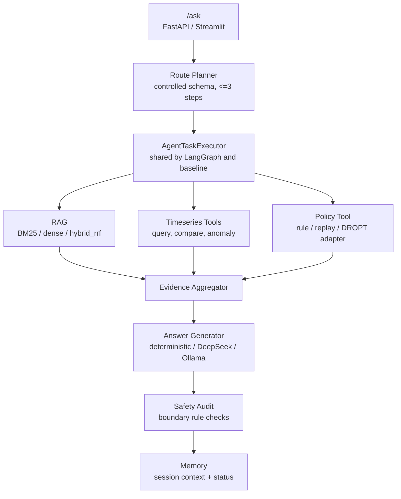

# DataCenter-HVAC Copilot

面向数据中心 HVAC 运维分析的 RAG + Tool Agent：系统基于 BEAR HVAC 仿真轨迹和运维知识文档，完成文档问答、时序查询、异常诊断、策略建议、可复现评测与会话记忆。

[](https://github.com/zwzwzwzwz123/DataCenter-HVAC-Copilot/actions/workflows/ci.yml)




<!-- 截图待补：Streamlit Copilot 主界面 -->


**核心亮点入口**：受控 LLM route planner、共享 executor 的可对照 workflow、`hybrid_rrf` 融合检索、FAISS 知识库原子索引、memory 失败降级与状态暴露。

## Highlights

**受控 LLM Route Planner**  
Planner 只允许输出 `document_qa`、`timeseries_query`、`anomaly_diagnosis`、`policy_recommendation` 四类 route，计划长度限制为 1-3 步，工具名和 `time_window` 也经过 schema 校验；如果包含 policy step，必须放在最后。这样把 LLM 用在“任务分解和路由”上，而不是让它自由调用工具或生成控制动作；非法 JSON、非法 route/tool、超长计划或 LLM 调用异常都会回退到 deterministic planner。代码位置：`src/agent/planner.py`。

**LangGraph Workflow 与 Deterministic Baseline 共享 Executor**  
LangGraph 编排和 deterministic baseline 复用同一个 `AgentTaskExecutor`，底层 RAG、时序工具、policy runner、answer audit 不因 workflow 变化而漂移。这个设计让 LangGraph 可以展示多步 trace 和可选 LLM planner，同时 baseline 仍然能作为回归对照；当前 `rag_tool_agent` 与 `langgraph_tool_agent` 在核心 eval 指标上保持一致。代码位置：`src/agent/langgraph_workflow.py`、`src/agent/executor.py`。

**`hybrid_rrf`：BM25 + Dense 的 RRF 融合检索**  
项目中严格区分两个名字相近的检索器：`rag_hybrid` 使用 `HybridRetriever`，实际是 BM25-style lexical retriever；`hybrid_rrf` 使用 `HybridRRFRetriever`，对 BM25 候选和 dense 候选做 Reciprocal Rank Fusion。这样可以在不把分数强行归一化的情况下融合 lexical precision 和 semantic recall，也能把 RRF 作为后续替换 embedding/reranker 的稳定实验入口。代码位置：`src/retrieval/retriever.py`、`src/evaluation/runner.py`。

**持久化知识库的 FAISS 原子索引**  
上传 PDF/DOCX/TXT/MD 后，系统解析为 chunks，元数据进入 SQLite，向量索引用 FAISS + `chunks.jsonl` sidecar + `manifest.json` 持久化。重建索引时先写临时文件，再原子替换正式文件，并在失败时恢复备份；加载时校验 manifest hash、FAISS 行数和 sidecar 行数，避免半写索引返回错误 citation。代码位置：`src/knowledge/indexer.py`、`src/knowledge/retriever.py`。

**Memory 降级不阻断主回答**  
`/ask` 支持 session-scoped conversation memory，但 memory 不是主链路的单点依赖。SQLite、retrieval、indexing、trace persistence 任一环节失败时，API 会在 `memory_status` 和 `workflow_trace` 中分层暴露状态，同时继续完成当前 RAG/tool/policy 回答。代码位置：`src/api/app.py`、`src/memory/context_manager.py`。

## Results

当前数字来自 `data/eval/baseline_comparison.json` 和 `data/eval/intent_routing_comparison.json`。主评测集为 `data/eval/hvac_eval.jsonl`，共 108 条：document QA 40、timeseries 20、anomaly 20、policy 28。

| Mode | Citation / Context | Expected Keyword | Tool Select | Tool Success | Evidence | Correctness Proxy | Faithfulness Proxy |
| --- | ---: | ---: | ---: | ---: | ---: | ---: | ---: |
| `rag_keyword` | 0.492 | 0.258 | 0.000 | 0.000 | 0.620 | 0.333 | 0.333 |
| `rag_hybrid` BM25 lexical | 0.523 | 0.295 | 0.000 | 0.000 | 0.620 | 0.344 | 0.328 |
| `hybrid_rrf` BM25 + dense RRF | 0.569 | 0.292 | 0.000 | 0.000 | 1.000 | 0.350 | 0.328 |
| `rag_hybrid_rerank` | 0.615 | 0.301 | 0.000 | 0.000 | 0.620 | 0.347 | 0.325 |
| `rag_tool_agent` | 0.338 | 0.628 | 0.882 | 1.000 | 0.917 | 0.541 | 0.486 |
| `langgraph_tool_agent` | 0.338 | 0.628 | 0.882 | 1.000 | 0.917 | 0.541 | 0.486 |
| `react_agent` | 0.338 | 0.644 | 0.956 | 1.000 | 0.917 | 0.582 | 0.527 |

这组结果说明两件事。第一，`hybrid_rrf` 相比 `rag_hybrid` 提升 citation/context recall（0.569 vs 0.523），但当前最强 citation/context 仍是轻量 rerank baseline（0.615）。第二，LangGraph 与 deterministic tool agent 指标一致，符合“workflow 变化不污染工具行为”的设计目标；`react_agent` 在当前 artifact 上 proxy 指标更高，但它不是默认 `/ask` workflow。

补充结果：

| Artifact | Metric | Value |
| --- | --- | ---: |
| `intent_routing_comparison.json` | rule-based intent accuracy, 100-sample artifact | 0.640 |
| `baseline_comparison.json` | safety adversarial overall hit rate | 0.586 |
| `baseline_comparison.json` | safety translation hit rate | 0.000 |
| `baseline_comparison.json` | DROPT policy benchmark success | 28 / 28 |

当前 `rag_dense` 数字来自默认 deterministic dense 配置，不代表 BGE-small-zh + FAISS。真实 embedding（BGE-small-zh + FAISS）的完整 eval 数字需重新 run 复现后替换。

## Quick Start

```bash
conda create -n hvac-copilot python=3.12
conda activate hvac-copilot
pip install -e ".[dev]"
```

可选：如果要运行 FAISS / sentence-transformers dense retrieval：

```bash
pip install -e ".[dev,dense]"
```

启动 API：

```bash
uvicorn src.api.app:app --reload
```

启动 Streamlit：

```bash
streamlit run app/streamlit_app.py
```

发送一个示例问题：

```bash
curl -X POST http://localhost:8000/ask ^
  -H "Content-Type: application/json" ^
  -d "{\"question\":\"最近 zone_temperature 有没有异常？\",\"workflow_engine\":\"langgraph\"}"
```

运行完整评测（本机实测约 8 分钟）：

```bash
python scripts/run_eval.py
```

使用 BGE-small-zh + FAISS 重新跑 dense / RRF 对照：

```bash
pip install -e ".[dev,dense]"
python scripts/run_eval.py --dense-provider sentence-transformers --dense-backend faiss --dense-model BAAI/bge-small-zh-v1.5
```

Docker 本地演示：

```bash
docker compose up --build
```

如需配置 DeepSeek/Ollama，可先复制 `.env.example` 到 `.env` 并填入对应变量；未配置时系统使用 deterministic fallback。

## Design

**把 LLM 放在受控边界内**  
系统允许 LLM 做 route planning 和 evidence-grounded answer generation，但不允许 LLM 直接写回控制动作。Planner 输出先经过 schema 校验，policy recommendation 由 policy tool 产生，answer generator 只解释 evidence 和 tool result。这个边界让 demo 更接近工程系统：可解释、可回退、可评测。

**把 workflow 编排和工具执行解耦**  
LangGraph 负责多步流程、trace 和 planner 接入；`AgentTaskExecutor` 负责实际工具行为。这样 workflow 可以迭代，评测仍能用 deterministic baseline 发现行为漂移，也便于把 agent 编排问题和工具正确性问题分开调试。

**把检索实验命名为可验证 baseline**  
`rag_keyword`、`rag_hybrid`、`hybrid_rrf`、`rag_hybrid_rerank` 分别对应不同 retriever / wrapper，而不是把所有检索都写成“hybrid”。这种命名降低了 README 和代码之间的语义风险，也让评测表能直接回答“哪个检索改动真的带来收益”。

**把知识库索引视为可恢复状态**  
SQLite 是 document/chunk metadata 的 source of truth，FAISS 是可重建索引。manifest、hash、sidecar 行数校验和原子替换让索引更新失败时保持旧索引可用，适合面向上传文档的 demo，而不是只在进程内维护一次性向量。

**把 memory 作为增强上下文，而不是主回答依赖**  
Memory 用于多轮指代、历史解释和 evidence refs，但当前问题的新鲜 RAG/tool/policy evidence 仍是回答主来源。API 分层返回 storage、retrieval、indexing、trace persistence 状态，让调用方知道 memory 是否参与了本轮回答。

## Scope & Limitations

系统使用 BEAR HVAC 仿真 rollout 和样例文档展示数据中心冷却分析流程，不把 BEAR 表述为真实生产遥测。这样做是为了在可复现环境里验证 RAG、tool use、policy boundary 和 eval pipeline。

评测以 deterministic metrics 和 proxy metrics 为主，包含 citation/context、tool selection/execution、evidence coverage、keyword coverage、correctness/faithfulness proxy。项目预留 human review 文件和 LLM judge adapter，但当前主结果不声称来自人工评审。

Safety audit 是关键词/规则审计，用于暴露“真实生产遥测”“LLM 直接控制”“未验证 policy action”等边界风险。当前 adversarial hit rate 为 0.586，其中 translation 类为 0.000，说明英文/翻译表达泛化弱；它是边界检查器，不是完整安全防护系统。

默认 dense eval artifact 使用 deterministic dense provider。BGE-small-zh + FAISS 的真实 embedding 数字需要通过 `scripts/run_eval.py --dense-provider sentence-transformers --dense-backend faiss --dense-model BAAI/bge-small-zh-v1.5` 重新 run 后确认。

## Project Structure

```text
src/agent/        planner, LangGraph workflow, shared executor, answer generator, audit
src/api/          FastAPI app, schemas, demo factory
src/retrieval/    keyword, BM25 lexical, dense, FAISS, RRF, rerank, query rewrite
src/knowledge/    upload parsing, SQLite metadata, FAISS indexer/retriever/service
src/memory/       SQLite conversation memory, retrieval, indexing, context budget
src/tools/        BEAR-like time-series query, compare, anomaly, energy breakdown
src/policies/     rule-based, offline replay, MPC-like, diffusion/DROPT adapters
src/evaluation/   dataset loader, metrics, baseline comparison, reports, judge hooks
src/ingestion/    BEAR schema, sample loader, processed rollout loader
app/              Streamlit demo
scripts/          eval, intent eval, compound eval generation, BEAR export
data/eval/        eval JSONL and current comparison artifacts
data/documents/   demo RAG documents
```

## Evaluation Details

默认完整评测：

```bash
python scripts/run_eval.py
```

该命令会生成：

```text
data/eval/baseline_predictions.jsonl
data/eval/baseline_comparison.json
docs/experiment_report.md
data/eval/human_review_sample.jsonl
data/eval/human_review_annotations.jsonl
```

Intent routing 单独评测：

```bash
python scripts/run_intent_eval.py --providers rule_based
```

当前 `intent_routing_comparison.json` 是 100-sample artifact；如果要和 108 条主评测集完全对齐，需要重新运行并更新 artifact。

## BEAR Export

仓库已包含 `data/bear_processed/bear_rollout.csv`，demo 会优先加载该 processed CSV；若不存在，再回退到 `BEAR/BEAR/Data/Exercise2A-mytest.csv`，最后使用内置 mock trajectory。

如需从外部 BEAR 仓库重新导出 rollout：

```bash
git clone https://github.com/chz056/BEAR.git ../BEAR
pip install -r ../BEAR/requirements.txt
python scripts/export_bear_data.py --bear-root ../BEAR --num-steps 336 --scenario-id bear_officesmall_tucson_14d_random --output data/bear_processed/bear_rollout.csv
```

导出的字段遵循 BEAR state layout：

```text
[zone_temperature(n), outdoor_temp(1), solar_irradiance/GHI(n), ground_temp(1), occupancy_power(n)]
```

## Resume One-Liner

构建 DataCenter-HVAC Copilot：基于 BEAR HVAC 仿真轨迹实现 RAG + Tool Agent + LangGraph workflow，包含 `hybrid_rrf` BM25+dense RRF 融合检索、受控 LLM route planner、共享 `AgentTaskExecutor` 的 baseline/LangGraph 可对照评测、FAISS 持久化知识库与 session memory 降级机制，并用 108 条 eval artifact 验证检索、工具调用、证据覆盖和回答质量 proxy。
