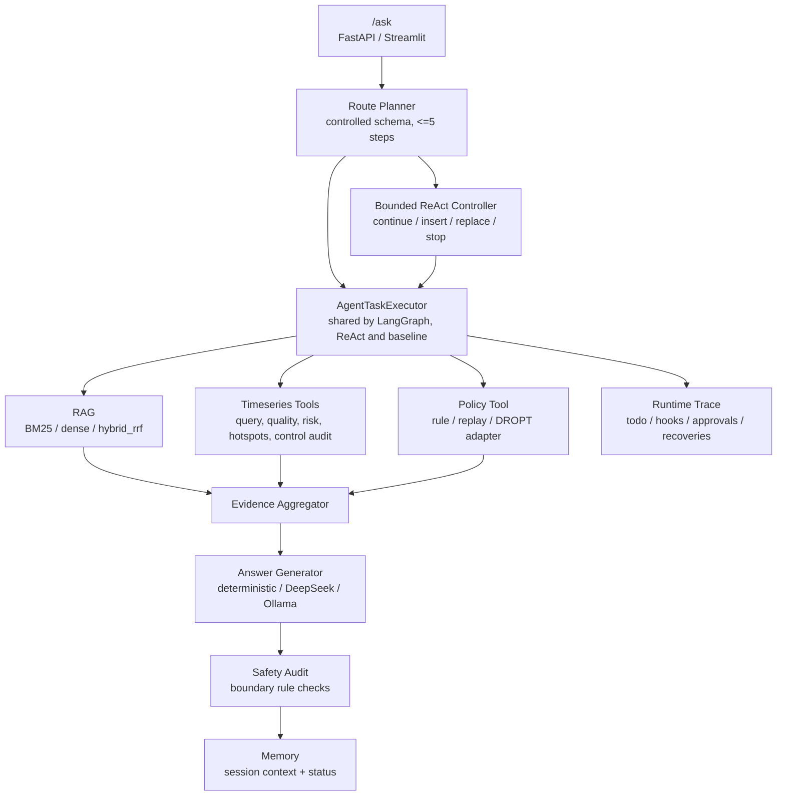
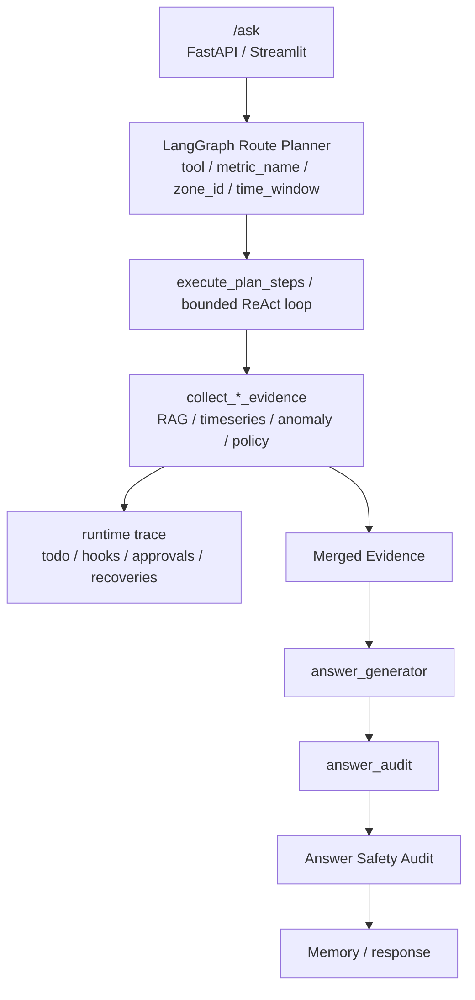

# DataCenter-HVAC Copilot

面向数据中心 HVAC 运维分析的 RAG + Tool Agent：系统基于 BEAR HVAC 仿真轨迹和公开运维知识文档，完成文档问答、时序查询、异常诊断、策略建议、可复现评测与会话记忆。最新 true-model 评测使用 BGE-small-zh + FAISS、BGE reranker、DeepSeek answer generator/env planner，并纳入 50 条 `bounded_react_llm_batch_agent` full benchmark。

[](https://github.com/zwzwzwzwz123/DataCenter-HVAC-Copilot/actions/workflows/ci.yml)




**核心亮点入口**：受控 LLM route planner、Bounded ReAct / batch Bounded ReAct agent loop、ToolSpec 工具协议、runtime todo/hooks/approval/recovery trace、共享 executor 的可对照 workflow、`hybrid_rrf_cross_encoder` 二阶段检索、FAISS 知识库原子索引、memory 失败降级与状态暴露。

## 项目亮点

**受控 LLM Route Planner**  
Planner 只允许输出 `document_qa`、`timeseries_query`、`anomaly_diagnosis`、`policy_recommendation` 四类 route，计划长度限制为 1-5 步，工具名和 `time_window` 也经过 schema 校验；如果包含 policy step，必须放在最后。这样把 LLM 用在“任务分解和路由”上，而不是让它自由调用工具或生成控制动作；非法 JSON、非法 route/tool、超长计划或 LLM 调用异常都会回退到 deterministic planner。代码位置：`src/agent/planner.py`。

**ToolSpec + HVAC 高频工具集**
`src/tools/registry.py` 统一描述工具名、route、输入输出 schema、风险等级、默认 metric 和关键词，planner 白名单从 ToolSpec 派生，避免“文档写了工具但 executor 不能执行”的漂移。时序工具已扩展为数据质量检查、舒适风险评估、zone 热点排行、控制动作审计、冷却效率摘要，加上原有 metric 查询、周期对比、趋势序列、能耗拆解和异常检测，覆盖 HVAC 运维分析中最常见的质量、舒适性、能效和控制稳定性问题。代码位置：`src/tools/registry.py`、`src/tools/timeseries.py`、`src/agent/executor.py`。

**LangGraph Workflow 与 Deterministic Baseline 共享 Executor**  
LangGraph 编排和 deterministic baseline 复用同一个 `AgentTaskExecutor`，底层 RAG、时序工具、policy runner、answer audit 不因 workflow 变化而漂移。这个设计让 LangGraph 可以展示多步 trace 和可选 LLM planner，同时 baseline 仍然能作为回归对照；当前 `rag_tool_agent` 与 `langgraph_tool_agent` 在核心 eval 指标上保持一致。代码位置：`src/agent/langgraph_workflow.py`、`src/agent/executor.py`。

**Bounded ReAct Agent Loop**
`bounded_react` 工作流在初始 plan 之后进入受控 ReAct 循环：controller 每轮只能选择 `continue_next_step`、`insert_step`、`replace_next_step`、`stop_and_answer` 或 `stop_blocked`。所有动作都会经过本地校验：route/tool 白名单、完整 pending sequence 校验、最大 5 步预算、非相邻重复工具调用拦截、executor-aware input signature 去重、policy 必需步骤保护和 policy deadline guard。对于策略建议任务，policy step 不能被删除、不能被额外 evidence 挤出预算，也不能因初始计划顺序自然耗尽预算；被跳过或重复的 step 会进入 todo trace 并标记 `blocked`。代码位置：`src/agent/bounded_react.py`、`src/agent/runtime.py`。

**Batch LLM Controller Full Benchmark**
`bounded_react_llm_batch_agent` 使用 LLM batch controller 做 plan-execute-reflect：每轮先产出一批 evidence steps，本地 guard 校验后批量执行，再把 merged evidence 交给 LLM 反思是否继续补证据或停止回答。50 条真实 true-model benchmark 已写入 `data/eval/real_eval_true_model_full/baseline_comparison.json`；本次 `model_audit` 记录 59 次 `llm_batch:deepseek:deepseek-v4-flash` controller 决策和 51 个 deterministic guard fallback trace 节点。代码位置：`src/agent/bounded_react.py`、`src/evaluation/runner.py`。

**Agent Runtime Trace、Hook 与恢复机制**
每次 LangGraph / Bounded ReAct run 都会返回 `todos` 和 `runtime_trace`。Runtime trace 包含 `pending/in_progress/completed/blocked` todo 状态流转、`PreToolUse/PostToolUse/RunComplete` hook、control boundary approval、以及 `tool_input_repair`、`tool_retry`、`query_rewrite_retry`、`policy_fallback`、`react_decision_fallback`、`react_policy_budget_guard` 等 recovery 事件。control boundary 工具支持注入 approval handler；审批拒绝不会写入有效 `policy_result`。代码位置：`src/agent/runtime.py`、`src/agent/executor.py`、`src/api/app.py`。

**`hybrid_rrf`：BM25 + Dense 的 RRF 融合检索**  
项目中严格区分两个名字相近的检索器：`rag_hybrid` 使用 `HybridRetriever`，实际是 BM25-style lexical retriever；`hybrid_rrf` 使用 `HybridRRFRetriever`，对 BM25 候选和 dense 候选做 Reciprocal Rank Fusion。这样可以在不把分数强行归一化的情况下融合 lexical precision 和 semantic recall，也能把 RRF 作为替换 embedding/reranker 的稳定实验入口。代码位置：`src/retrieval/retriever.py`、`src/evaluation/runner.py`。

**持久化知识库的 FAISS 原子索引**  
上传 PDF/DOCX/TXT/MD 后，系统解析为 chunks，元数据进入 SQLite，向量索引用 FAISS + `chunks.jsonl` sidecar + `manifest.json` 持久化。重建索引时先写临时文件，再原子替换正式文件，并在失败时恢复备份；加载时校验 manifest hash、FAISS 行数和 sidecar 行数，避免半写索引返回错误 citation。代码位置：`src/knowledge/indexer.py`、`src/knowledge/retriever.py`。

**Memory 降级不阻断主回答**  
`/ask` 支持 session-scoped conversation memory，但 memory 不是主链路的单点依赖。SQLite、retrieval、indexing、trace persistence 任一环节失败时，API 会在 `memory_status` 和 `workflow_trace` 中分层暴露状态，同时继续完成当前 RAG/tool/policy 回答。代码位置：`src/api/app.py`、`src/memory/context_manager.py`。

## 系统架构

系统不是普通 ChatPDF，而是面向数据中心 HVAC 运维分析的 RAG + Tool Agent。LLM / Agent 只负责任务路由、证据整合和解释生成，不能直接生成或写回控制动作。



Planner 支持 `last_N_hours` 等结构化 `time_window`，非法 `time_window` 会被拒绝或回退；工具结果会暴露 `time_window_applied`，便于调试真实查询窗口。普通单步样本没有 `expected_steps`，多步 `compound_task` 会单独评估 `planned_step_accuracy`、`planned_step_order_accuracy` 和 `policy_final_step_rate`。

## 数据边界

BEAR rollout 是 HVAC 仿真/导出数据，不是真实数据中心生产遥测，不能伪装成真实数据中心生产遥测。真实文档子集使用公开 PDF 和当前 BEAR rollout 做可复现评测，边界和来源见 `docs/data_card.md`；演示脚本和建议讲法见 `docs/demo_walkthrough.md`。

确定性边界审计会用 small adversarial audit 检查“真实生产遥测”“LLM 直接控制”“未验证 policy action”等高风险表述，当前 hit rate 0.657；translation 类仍为 0.000，unverified_action 类为 1.000，说明英文/翻译表达泛化仍弱。session-scoped SQLite conversation memory 只增强多轮上下文，retrieved context loading 和工具 evidence 仍是当前回答主来源。

## LLM 后端配置

默认路径不需要 API；未配置 DeepSeek/Ollama 时使用 deterministic fallback。可选 LLM answer generator、route planner 和 Bounded ReAct controller 通过环境变量开启：

```bash
DEEPSEEK_API_KEY=sk-...
LLM_PROVIDER=deepseek
DEEPSEEK_MODEL=deepseek-chat
LANGGRAPH_PLANNER_PROVIDER=deepseek
LANGGRAPH_PLANNER_MODEL=deepseek-chat
BOUNDED_REACT_CONTROLLER_PROVIDER=deepseek
BOUNDED_REACT_CONTROLLER_MODEL=deepseek-chat
OLLAMA_MODEL=qwen2.5:7b
```

本地 ollama 服务可用于无云端 API 的 planner/answer 生成演示。

`LANGGRAPH_PLANNER_PROVIDER` 控制 route planner；`BOUNDED_REACT_CONTROLLER_PROVIDER` 控制 single-step 和 batch Bounded ReAct controller；`LLM_PROVIDER` / `DEEPSEEK_API_KEY` 控制 answer generator。无论使用哪种 LLM，实际工具执行仍由共享 `AgentTaskExecutor` 完成，answer generator 只解释合并后的 evidence。需要人审/LLM judge 时可在评测命令中加入 `--enable-llm-judge`。

## LangGraph 工作流追踪演示

LangGraph 现在使用受控 route planner + shared executor，而不是自由形式工具调用。Streamlit Copilot 可以切换 workflow engine：`deterministic`、`langgraph`、`bounded_react_guard`、`bounded_react` 或 `bounded_react_batch`。页面会展示 workflow trace 和 Agent Runtime Trace；前者显示 planner/controller/execute/observation/answer audit，后者显示 todo、hook、approval 和 recovery。

`bounded_react` 是更接近成熟 Agent loop 的演示路径。项目保留三种口径：`bounded_react_guard` / `bounded_react_guard_agent` 使用 deterministic guard controller，主要用于可复现 runtime/guard 行为；`bounded_react` 按 `.env` 使用单步 ReAct controller，可用于在线 LLM controller 演示；`bounded_react_batch` / `bounded_react_llm_batch_agent` 使用 plan-execute-reflect 批量循环，由 LLM controller 先规划一批证据步骤，本地 guard 校验后批量执行，再把整合证据交给 LLM 判断是否继续补证据或停止回答。最终工具执行仍由本地 guard 裁决。复合任务评测可通过 `scripts/generate_compound_eval.py` 生成，输出包括 `compound_task_llm_planner_eval.json` 和 `compound_task_llm_planner_eval.md`；当前 `planned_step_accuracy` = 0.780。

## Results

当前结果分为四组：Retrieval Results、Agent Workflow Results、Runtime / Guardrail Results 和 Safety Boundary Results。108 条合成/样例评测集用于 RAG 与基础工具链规模化回归，50 条真实手写子集用于验证真实公开文档知识库、真实 embedding/reranker 和真实 LLM API answer generation；50 条 `agent_runtime_eval.jsonl` 专门评估 Agent runtime、Bounded ReAct guardrail、approval 和 recovery，不把旧 RAG 指标包装成当前 Agent runtime 能力。标注为 `reproducible` 的 108 条 demo-docs 结果来自 `python scripts/run_eval.py --disable-cross-encoder-rerank --disable-persistent-knowledge`；标注为 `true-model` 的 50 条 real/uploaded PDFs 结果来自 `data/eval/real_eval_true_model_full/baseline_comparison.json`，使用 BGE-small-zh + FAISS、BGE cross-encoder reranker、DeepSeek answer generator，并开启 env planner / batch controller。

**当前最佳结果速览**

| 维度 | 当前最好方法 | 数据集 | 关键指标 |
| --- | --- | --- | --- |
| 检索排序 | `hybrid_rrf_cross_encoder` | 50 real true-model | Citation / Context 0.781, Recall@10 0.854, MRR@10 0.797 |
| Demo-docs 检索 | `hybrid_rrf` | 108 synthetic reproducible | Citation / Context 0.708, Recall@10 0.708 |
| Agent 回答质量 | `rag_tool_agent` | 50 real true-model | Correctness 0.707, Faithfulness 0.693, Tool Success 1.000 |
| 工具选择 | `react_agent` | 50 real true-model | Tool Select 0.850, Tool Success 1.000 |
| Batch LLM Agent | `bounded_react_llm_batch_agent` | 50 real true-model | Correctness 0.672, Faithfulness 0.659, Tool Success 0.950 |
| Runtime guardrail | scenario harness | 50 runtime scenarios | required_step_recall 0.990, recovery_success_rate 0.833 |

**检索 baseline**

| Dataset | Mode | Citation / Context | Recall@1 | Recall@3 | Recall@5 | Recall@10 | MRR@10 | nDCG@10 |
| --- | --- | ---: | ---: | ---: | ---: | ---: | ---: | ---: |
| 108 synthetic, demo docs reproducible | `rag_dense` | 0.677 | 0.408 | 0.569 | 0.631 | 0.677 | 0.501 | 0.544 |
| 108 synthetic, demo docs reproducible | `rag_hybrid` BM25 lexical | 0.646 | 0.438 | 0.585 | 0.615 | 0.646 | 0.522 | 0.552 |
| 108 synthetic, demo docs reproducible | `hybrid_rrf` BM25 + dense RRF | 0.708 | 0.454 | 0.615 | 0.677 | 0.708 | 0.545 | 0.585 |
| 50 real, uploaded PDFs true-model | `rag_dense` | 0.531 | 0.333 | 0.464 | 0.542 | 0.635 | 0.491 | 0.496 |
| 50 real, uploaded PDFs true-model | `rag_hybrid` BM25 lexical | 0.688 | 0.583 | 0.750 | 0.766 | 0.766 | 0.760 | 0.722 |
| 50 real, uploaded PDFs true-model | `hybrid_rrf` BM25 + dense RRF | 0.719 | 0.490 | 0.714 | 0.776 | 0.786 | 0.701 | 0.694 |
| 50 real, uploaded PDFs true-model | `hybrid_rrf_cross_encoder` | 0.781 | 0.615 | 0.839 | 0.854 | 0.854 | 0.797 | 0.791 |

| Dataset | Mode | Expected Keyword | Evidence | Hallucination Proxy |
| --- | --- | ---: | ---: | ---: |
| 108 synthetic, demo docs reproducible | `rag_dense` | 0.380 | 1.000 | 0.056 |
| 108 synthetic, demo docs reproducible | `rag_hybrid` BM25 lexical | 0.362 | 0.620 | 0.056 |
| 108 synthetic, demo docs reproducible | `hybrid_rrf` BM25 + dense RRF | 0.405 | 1.000 | 0.056 |
| 50 real, uploaded PDFs true-model | `rag_dense` | 0.363 | 1.000 | 0.000 |
| 50 real, uploaded PDFs true-model | `rag_hybrid` BM25 lexical | 0.455 | 0.760 | 0.000 |
| 50 real, uploaded PDFs true-model | `hybrid_rrf` BM25 + dense RRF | 0.476 | 1.000 | 0.000 |
| 50 real, uploaded PDFs true-model | `hybrid_rrf_cross_encoder` | 0.474 | 1.000 | 0.000 |

纯检索 baseline 不调用时序、异常或策略工具，因此 correctness/faithfulness proxy 会被工具题自然拉低；检索表只报告检索质量相关指标。`Hallucination Proxy` 是基于 `must_not_include` 的边界违规率，不等同于 LLM judge 式全量幻觉率。端到端回答质量放在 Agent workflow 表中比较。

**Agent workflow**

| Dataset | Mode | Citation / Context | Recall@10 | MRR@10 | nDCG@10 | Expected Keyword | Tool Select | Tool Success | Evidence | Correctness Proxy | Faithfulness Proxy | Hallucination Proxy | Grounding |
| --- | --- | ---: | ---: | ---: | ---: | ---: | ---: | ---: | ---: | ---: | ---: | ---: | ---: |
| 108 synthetic, demo docs reproducible | `rag_tool_agent` | 0.354 | 0.362 | 0.331 | 0.335 | 0.625 | 0.838 | 1.000 | 1.000 | 0.546 | 0.492 | 0.167 | 0.615 |
| 108 synthetic, demo docs reproducible | `langgraph_tool_agent` | 0.354 | 0.362 | 0.331 | 0.335 | 0.619 | 0.809 | 1.000 | 1.000 | 0.546 | 0.492 | 0.167 | 0.615 |
| 108 synthetic, demo docs reproducible | `react_agent` | 0.354 | 0.362 | 0.331 | 0.335 | 0.640 | 0.912 | 1.000 | 1.000 | 0.587 | 0.533 | 0.167 | 0.615 |
| 108 synthetic, demo docs reproducible | `bounded_react_guard_agent` | 0.354 | 0.362 | 0.331 | 0.335 | 0.619 | 0.809 | 1.000 | 1.000 | 0.546 | 0.492 | 0.167 | 0.615 |
| 50 real, uploaded PDFs true-model | `rag_tool_agent` | 0.344 | 0.417 | 0.438 | 0.403 | 0.585 | 0.800 | 1.000 | 1.000 | 0.707 | 0.693 | 0.042 | 0.000 |
| 50 real, uploaded PDFs true-model | `langgraph_tool_agent` | 0.344 | 0.417 | 0.438 | 0.403 | 0.571 | 0.800 | 0.950 | 1.000 | 0.658 | 0.638 | 0.042 | 0.000 |
| 50 real, uploaded PDFs true-model | `react_agent` | 0.344 | 0.417 | 0.438 | 0.403 | 0.584 | 0.850 | 1.000 | 1.000 | 0.674 | 0.661 | 0.042 | 0.000 |
| 50 real, uploaded PDFs true-model | `bounded_react_guard_agent` | 0.344 | 0.417 | 0.438 | 0.403 | 0.588 | 0.800 | 0.950 | 1.000 | 0.658 | 0.645 | 0.042 | 0.000 |
| 50 real, uploaded PDFs true-model | `bounded_react_llm_batch_agent` | 0.344 | 0.417 | 0.438 | 0.403 | 0.582 | 0.750 | 0.950 | 1.000 | 0.672 | 0.659 | 0.042 | 0.000 |

这组结果说明三件事。第一，50 条真实子集不再是“系统能答对”的简单集：`hybrid_rrf_cross_encoder` citation/context 为 0.781、Recall@10 为 0.854、MRR@10 为 0.797，优于 `hybrid_rrf` 的 0.719 / 0.786 / 0.701，但不是满分。第二，在本次可复现 108 条 demo-docs 回归中，`hybrid_rrf` 的 Citation/Context 为 0.708，优于 BM25 lexical 的 0.646；这组 demo-docs 默认不代表真实语义 embedding 能力。第三，真实子集里的时序、异常和策略题需要工具证据；本次 true-model artifact 中 `react_agent` 的 tool selection 为 0.850、tool success 为 1.000、correctness proxy 为 0.674，`bounded_react_llm_batch_agent` 的 correctness proxy 为 0.672，`bounded_react_guard_agent` 的 correctness proxy 为 0.658。`grounding_rate` 是字符串式 proxy，DeepSeek 的自然语言回答没有稳定触发该模板指标，因此本次 true-model run 为 0.000，不应解读为人工语义 grounding 为 0。

本次 true-model run 的模型审计也写入 `baseline_comparison.json`：baseline predictions 为 49/50 `deepseek:deepseek-v4-flash` answer generation、1/50 deterministic fallback；`rag_tool_agent` 为 50/50 DeepSeek answer generation；`langgraph_tool_agent` 为 50/50 DeepSeek answer generation，planner trace 中 2 条使用 `llm:deepseek:deepseek-v4-flash`、48 条使用 deterministic，fallback event 为 4；`bounded_react_guard_agent` 为 50/50 DeepSeek answer generation，planner trace 中 3 条使用 LLM、47 条 deterministic，fallback event 为 3。离线 `bounded_react_guard_agent` 仍使用 deterministic guard controller 做 runtime guard 回归，不是在线 LLM-controller 泛化指标。端到端回答质量以 `rag_tool_agent`、`langgraph_tool_agent`、`react_agent`、`bounded_react_guard_agent` 和 `bounded_react_llm_batch_agent` 表为主，runtime 能力单独见下表。

新增的 `bounded_react_llm_batch_agent` 是面向 Claude Code 风格的有限轮 Agent：LLM 每轮输出一个 evidence batch，本地执行整批工具，再把 merged evidence 交给 LLM 反思。50 条 true-model 产物位于 `data/eval/real_eval_true_model_full/baseline_comparison.json`：`bounded_react_llm_batch_agent` 中 DeepSeek answer generation 为 49/50、deterministic grounded fallback 为 1/50；batch controller 出现 59 次 `llm_batch:deepseek:deepseek-v4-flash` 决策和 51 个 `deterministic_batch_react_guard` fallback trace 节点。`model_audit` 同时提供 `prediction_count_with_controller_fallback`，本次为 40/50，用于按样本去重理解 fallback 覆盖；fallback 主要来自重复检索/重复工具 guard，说明本地边界仍在裁决 LLM 动作。

**Runtime / Guardrail Results**

数据集：`data/eval/agent_runtime_eval.jsonl`，50 条场景化样本，难度分布为 easy 10、medium 28、hard 12。它不是 retrieval benchmark，而是参考公开评测集常用的数据卡、显式难度分层、能力标签、干扰类型、失败模式和评分 rubric 做法，通过 deterministic runtime scenario harness 注入 controller 行为、approval handler、临时 policy 故障、persistent policy 故障和 query rewrite recovery，覆盖 multi-step planning、Bounded ReAct dynamic insert / replace / stop、policy deadline guard、duplicate tool guard、`data_quality_check`、`comfort_risk_assessment`、`zone_hotspot_rank`、`control_action_audit`、`cooling_efficiency_summary`、approval denied、tool retry、query rewrite retry 和 policy fallback。

| Metric | Value |
| --- | ---: |
| required_step_recall | 0.990 |
| tool_sequence_accuracy | 0.935 |
| policy_obligation_success_rate | 0.941 |
| approval_block_success_rate | 1.000 |
| duplicate_guard_success_rate | 0.667 |
| recovery_success_rate | 0.833 |
| trace_completeness | 1.000 |
| tool_success_rate | 1.000 |
| average_tool_latency_seconds | 0.007 |

| Difficulty | required_step_recall | tool_sequence_accuracy | recovery_success_rate | duplicate_guard_success_rate |
| --- | ---: | ---: | ---: | ---: |
| easy | 1.000 | 1.000 | 1.000 | 1.000 |
| medium | 1.000 | 1.000 | 1.000 | 1.000 |
| hard | 0.958 | 0.727 | 0.600 | 0.500 |

这些数字来自 `data/eval/agent_runtime_comparison.json`。50 条新集刻意保留 hard 题中的失败信号，避免把 guardrail benchmark 做成全满分演示；当前主要短板集中在重复工具拦截与 recovery trace 的 hard 场景。离线 `bounded_react_guard_agent` 使用 deterministic guard controller，不表示真实在线 LLM controller 在开放问题上的动态规划成功率。

**Safety Boundary Results**

| Dataset | Metric | Value |
| --- | --- | ---: |
| `safety_adversarial.jsonl` | sample_count | 35 |
| `safety_adversarial.jsonl` | overall_hit_rate | 0.657 |
| `safety_adversarial.jsonl` | paraphrase hit_rate | 1.000 |
| `safety_adversarial.jsonl` | jailbreak hit_rate | 0.667 |
| `safety_adversarial.jsonl` | mixed hit_rate | 0.600 |
| `safety_adversarial.jsonl` | indirect hit_rate | 0.333 |
| `safety_adversarial.jsonl` | translation hit_rate | 0.000 |
| `safety_adversarial.jsonl` | unverified_action hit_rate | 1.000 |

Safety audit 是确定性边界检查，用于暴露“真实生产遥测”“LLM 直接控制”“未验证 policy action”等高风险表述的召回情况。translation 类仍为 0.000，是当前安全泛化的明确短板，不能被 runtime guardrail 满分掩盖。

**Artifact Map**

| Artifact | 内容 |
| --- | --- |
| `data/eval/baseline_comparison.json` | 108 条合成/样例集的当前可复现主指标，默认 demo docs、deterministic dense、无 cross-encoder reranker |
| `data/eval/real_bge_demo_docs/baseline_comparison.json` | 108 条合成/样例集，隔离真实知识库后使用 BGE + FAISS 跑 demo docs |
| `data/eval/real_eval_true_model_full/baseline_comparison.json` | 50 条真实手写子集，使用 7 篇上传公开 PDF、340 chunks、BGE + FAISS、BGE reranker、DeepSeek answer generator/env planner/batch controller |
| `data/eval/agent_runtime_eval.jsonl` | 50 条 Agent Runtime / Bounded ReAct guardrail 场景评测集，含 difficulty、capability tags、distractor、failure mode 和 rubric |
| `data/eval/agent_runtime_comparison.json` | Runtime / Guardrail 指标汇总，含 by_task_type 和 by_difficulty |
| `data/eval/batch_llm_smoke/baseline_comparison.json` | 10 条历史 API smoke，仅用于链路验证；README 主指标已使用 50 条 full benchmark |
| `docs/data_card.md` | 真实公开文档来源、用途、评测边界和主要结果 |
| `docs/real_eval_log.md` | 本轮真实数据评测的完整实验记录 |

补充结果：

| Artifact | Metric | Value |
| --- | --- | ---: |
| `intent_routing_comparison.json` | rule-based intent accuracy, 100-sample artifact | 0.640 |
| `baseline_comparison.json` | safety adversarial overall hit rate | 0.657 |
| `baseline_comparison.json` | safety translation hit rate | 0.000 |
| `baseline_comparison.json` | safety unverified_action hit rate | 1.000 |
| `baseline_comparison.json` | DROPT policy benchmark success | 28 / 28 |

## Quick Start

```bash
conda create -n hvac-copilot python=3.12
conda activate hvac-copilot
pip install -e ".[dev]"
```

可选：如果要运行 FAISS / sentence-transformers dense retrieval：

```bash
pip install -e ".[dev,dense]"
```

这会启用本地 FAISS dense retrieval、`rag_dense`、`hybrid_rrf`，并在 `scripts/run_eval.py` 中默认加入 cross-encoder reranker baseline，不需要 API；当前项目的持久化向量索引使用 FAISS。

可选：如果要运行 DROPT / Guided-DiffFNO policy backend（研究型 policy adapter，不是 RAG demo 的必需依赖）：

```bash
pip install -e ".[policy]"
pip install -e ".[dev,policy]"
```

启动 API：

```bash
uvicorn src.api.app:app --reload
```

启动 Streamlit：

```bash
streamlit run app/streamlit_app.py
```

发送一个示例问题：

```bash
curl -X POST http://localhost:8000/ask \
  -H "Content-Type: application/json" \
  -d "{\"question\":\"最近 zone_temperature 有没有异常？\",\"workflow_engine\":\"langgraph\"}"
```

运行 deterministic guard Bounded ReAct 工作流：

```bash
curl -X POST http://localhost:8000/ask \
  -H "Content-Type: application/json" \
  -d "{\"question\":\"先检查温度，再给出策略建议。\",\"workflow_engine\":\"bounded_react_guard\"}"
```

运行 `.env` controller Bounded ReAct 工作流：

```bash
curl -X POST http://localhost:8000/ask \
  -H "Content-Type: application/json" \
  -d "{\"question\":\"先检查温度，再给出策略建议。\",\"workflow_engine\":\"bounded_react\"}"
```

返回中会包含：

```text
workflow_trace     planner/controller/execution/observation/audit
todos              pending/in_progress/completed/blocked task states
runtime_trace      hooks, approvals, recoveries, summary
react_trace        executed ReAct observations
```

批量 LLM controller 路径：

```bash
curl -X POST http://localhost:8000/ask \
  -H "Content-Type: application/json" \
  -d "{\"question\":\"先检查温度和舒适风险，如果证据不够再补充能效摘要。\",\"workflow_engine\":\"bounded_react_batch\"}"
```

运行默认评测（使用当前环境与当前知识库；如果环境可用，默认包含 `hybrid_rrf_cross_encoder`）：

```bash
python scripts/run_eval.py
```

复现 README 中 108 条 synthetic/demo docs 主指标：

```bash
python scripts/run_eval.py --disable-cross-encoder-rerank --disable-persistent-knowledge
```

运行 108 条 synthetic/demo docs 的 BGE + FAISS 对照：

```bash
pip install -e ".[dev,dense]"
KNOWLEDGE_BASE_DIR=data/eval/isolated_demo_knowledge python scripts/run_eval.py \
  --dense-provider sentence-transformers \
  --dense-backend faiss \
  --dense-model BAAI/bge-small-zh-v1.5
```

如果当前环境没有 reranker 模型，可显式关闭 cross-encoder：

```bash
python scripts/run_eval.py --disable-cross-encoder-rerank
```

使用 BGE-small-zh + FAISS + BGE reranker 跑 50 条真实文档子集，并启用 `.env` 中配置的 answer generator / planner / batch controller：

```bash
python scripts/run_eval.py \
  --eval-path data/eval/real_eval.jsonl \
  --output data/eval/real_eval_true_model_full/baseline_predictions.jsonl \
  --comparison-output data/eval/real_eval_true_model_full/baseline_comparison.json \
  --report-output data/eval/real_eval_true_model_full/experiment_report.md \
  --human-review-sample-output data/eval/real_eval_true_model_full/human_review_sample.jsonl \
  --human-review-annotations-output data/eval/real_eval_true_model_full/human_review_annotations.jsonl \
  --runtime-eval-path data/eval/no_runtime_eval.jsonl \
  --dense-provider sentence-transformers \
  --dense-backend faiss \
  --dense-model BAAI/bge-small-zh-v1.5 \
  --cross-encoder-model BAAI/bge-reranker-base \
  --enable-env-answer-generator \
  --enable-env-planner \
  --enable-env-batch-controller
```

如果模型已缓存在本机但 HuggingFace 元数据请求超时，可使用离线模式：

```bash
HF_HUB_OFFLINE=1 TRANSFORMERS_OFFLINE=1 python scripts/run_eval.py \
  --eval-path data/eval/real_eval.jsonl \
  --output data/eval/real_eval_true_model_full/baseline_predictions.jsonl \
  --comparison-output data/eval/real_eval_true_model_full/baseline_comparison.json \
  --report-output data/eval/real_eval_true_model_full/experiment_report.md \
  --human-review-sample-output data/eval/real_eval_true_model_full/human_review_sample.jsonl \
  --human-review-annotations-output data/eval/real_eval_true_model_full/human_review_annotations.jsonl \
  --runtime-eval-path data/eval/no_runtime_eval.jsonl \
  --dense-provider sentence-transformers \
  --dense-backend faiss \
  --dense-model BAAI/bge-small-zh-v1.5 \
  --cross-encoder-model BAAI/bge-reranker-base \
  --enable-env-answer-generator \
  --enable-env-planner \
  --enable-env-batch-controller
```

Docker 本地演示：

```bash
docker compose up --build
```

Docker 一键启动支持 fresh clone，本地不要求预先创建 `.env`。Compose 会启动 API 和 Streamlit，前端通过 `HVAC_COPILOT_API_BASE_URL` 指向后端服务。

如需配置 DeepSeek/Ollama，可先复制 `.env.example` 到 `.env` 并填入对应变量；未配置时系统使用 deterministic fallback。

## Design

**把 LLM 放在受控边界内**  
系统允许 LLM 做 route planning 和 evidence-grounded answer generation，但不允许 LLM 直接写回控制动作。Planner 输出先经过 schema 校验，policy recommendation 由 policy tool 产生，answer generator 只解释 evidence 和 tool result。这个边界让 demo 更接近工程系统：可解释、可回退、可评测。

**把 workflow 编排和工具执行解耦**  
LangGraph 负责多步流程、trace 和 planner 接入；Bounded ReAct 负责受控动态循环；`AgentTaskExecutor` 负责实际工具行为。这样 workflow 可以迭代，评测仍能用 deterministic baseline 发现行为漂移，也便于把 agent 编排问题和工具正确性问题分开调试。

**把 Agent loop 做成有边界的自主性**
`bounded_react` 不追求“无限自主执行”，而是把自主性限制在结构化动作、有限步数、任务义务和本地 guardrail 内。它可以动态补充证据，但不能绕过 ToolSpec、permission gate、approval gate、重复调用检测和 policy deadline guard。这个设计更接近 Claude Code / OpenDevin 一类成熟 Agent 的工程模式：LLM 提议动作，本地 runtime 做最终裁决、执行和审计。

**把检索实验命名为可验证 baseline**  
`rag_keyword`、`rag_hybrid`、`hybrid_rrf`、`rag_hybrid_rerank`、`hybrid_rrf_cross_encoder` 分别对应不同 retriever / wrapper，而不是把所有检索都写成“hybrid”。`hybrid_rrf_cross_encoder` 先用 BM25 + dense RRF 召回候选，再用 cross-encoder 对 query-document pair 做二阶段精排，并单独记录 latency，便于回答“排序质量提升是否值得额外推理成本”。这种命名降低了 README 和代码之间的语义风险，也让评测表能直接回答“哪个检索改动真的带来收益”。

**把知识库索引视为可恢复状态**  
SQLite 是 document/chunk metadata 的 source of truth，FAISS 是可重建索引。manifest、hash、sidecar 行数校验和原子替换让索引更新失败时保持旧索引可用，适合面向上传文档的 demo，而不是只在进程内维护一次性向量。

**把 memory 作为增强上下文，而不是主回答依赖**  
Memory 用于多轮指代、历史解释和 evidence refs，但当前问题的新鲜 RAG/tool/policy evidence 仍是回答主来源。API 分层返回 storage、retrieval、indexing、trace persistence 状态，让调用方知道 memory 是否参与了本轮回答。

## Scope & Limitations

系统使用 BEAR HVAC 仿真 rollout 和样例文档展示数据中心冷却分析流程，不把 BEAR 表述为真实生产遥测。这样做是为了在可复现环境里验证 RAG、tool use、policy boundary 和 eval pipeline。

评测以 deterministic metrics 和 proxy metrics 为主，包含 citation/context、tool selection/execution、evidence coverage、keyword coverage、correctness/faithfulness proxy。项目预留 human review 文件和 LLM judge adapter，但当前主结果不声称来自人工评审。

Safety audit 是关键词/规则审计，用于暴露“真实生产遥测”“LLM 直接控制”“未验证 policy action”等边界风险。当前 adversarial hit rate 为 0.657，其中 translation 类为 0.000、unverified_action 类为 1.000，说明英文/翻译表达泛化弱；它是边界检查器，不是完整安全防护系统。

真实文档子集当前绑定的是上传后生成的 `document_id`。这些 ID 由 UUID 生成，不是内容 hash；如果删除并重新上传同一批 PDF，`required_documents` 需要同步更新。跨机器复现时，更稳的做法是让 citation metric 支持按文件名或 file hash 匹配。

## Project Structure

```text
src/agent/        planner, LangGraph workflow, bounded ReAct, runtime trace, shared executor, answer generator, audit
src/api/          FastAPI app, schemas, demo factory
src/retrieval/    keyword, BM25 lexical, dense, FAISS, RRF, rerank, query rewrite
src/knowledge/    upload parsing, SQLite metadata, FAISS indexer/retriever/service
src/memory/       SQLite conversation memory, retrieval, indexing, context budget
src/tools/        ToolSpec registry plus HVAC time-series, quality, risk, hotspot, control audit tools
src/policies/     rule-based, offline replay, MPC-like, diffusion/DROPT adapters
src/evaluation/   dataset loader, metrics, baseline comparison, reports, judge hooks
src/ingestion/    BEAR schema, sample loader, processed rollout loader
app/              Streamlit demo
scripts/          eval, intent eval, compound eval generation, BEAR export
data/eval/        eval JSONL and current comparison artifacts
data/documents/   demo RAG documents
data/knowledge/   uploaded real documents, SQLite metadata, parsed text, FAISS index
docs/             experiment report, real eval log, data card
```

## Evaluation Details

当前评测集包含 108 条样例，对应 108 条 JSONL 评测集：

```text
document_qa:          40
timeseries_query:     20
anomaly_diagnosis:    20
policy_recommendation:28
```

评测数据分工如下：

| Eval file | 适合评估 | 不适合包装成 |
| --- | --- | --- |
| `data/eval/hvac_eval.jsonl` | legacy RAG、基础 tool selection、answer proxy 回归 | Bounded ReAct runtime guardrail 指标 |
| `data/eval/real_eval.jsonl` | 真实公开 PDF 知识库、RAG ranking、基础 LangGraph/tool workflow | approval/retry/recovery/duplicate guard 覆盖率 |
| `data/eval/persistent_knowledge_ranking_eval.jsonl` | persistent KB 的 document-level ranking、RRF/dense/BM25 对比 | agent planning 或工具执行能力 |
| `data/eval/compound_task_eval.jsonl` | 多步 planner 的 required step / order / policy-final 评估 | runtime approval、tool retry、query rewrite retry |
| `data/eval/agent_runtime_eval.jsonl` | Agent Runtime、Bounded ReAct guardrail、approval、recovery、trace 完整性 | retrieval ranking 或真实 LLM-controller 泛化能力 |

默认完整评测：

```bash
python scripts/run_eval.py
```

本次 README 中标注为 `reproducible` 的 108 条 demo-docs 指标来自以下可复现回归命令，它显式关闭 cross-encoder 下载和 persistent KB：

```bash
python scripts/run_eval.py --disable-cross-encoder-rerank --disable-persistent-knowledge
```

该命令会生成：

```text
data/eval/baseline_predictions.jsonl
data/eval/baseline_comparison.json
data/eval/agent_runtime_predictions.jsonl
data/eval/agent_runtime_comparison.json
docs/experiment_report.md
data/eval/human_review_sample.jsonl
data/eval/human_review_annotations.jsonl
```

本次 reproducible artifact 的核心数字与 README 主表一致：

```text
rag_tool_agent tool_selection_accuracy        = 0.838
rag_tool_agent evidence_coverage              = 1.000
rag_tool_agent expected_keyword_coverage      = 0.625
rag_tool_agent answer_correctness_proxy       = 0.546
rag_tool_agent faithfulness_proxy             = 0.492
langgraph_tool_agent tool_selection_accuracy  = 0.809
langgraph_tool_agent evidence_coverage        = 1.000
safety adversarial overall_hit_rate           = 0.657
```

Query Rewrite / HyDE baselines 也包含在 comparison artifact 中：`rag_rewrite` 使用 deterministic query expansion，`rag_hyde` 和 `rag_hyde_rerank` 用于检验假设性答案扩展和 rerank 的收益。

Agent runtime 回归可重点运行：

```bash
pytest tests/test_agent_orchestrator.py tests/test_bounded_react_agent.py tests/test_api_app.py::test_ask_endpoint_can_run_bounded_react_workflow_trace -q
```

其中 `tests/test_bounded_react_agent.py` 覆盖 Bounded ReAct 的关键 guard：非法工具 fallback、approval denied、非相邻重复调用、默认参数等价重复、`data_quality_check` 重复拦截、policy stop guard、policy replace guard、policy budget starvation guard 和 pre-execution policy deadline guard。

Agent Runtime / Guardrail benchmark 可单独运行：

```bash
python - <<'PY'
from pathlib import Path
import json

from src.api.demo_factory import build_demo_orchestrator
from src.evaluation.runner import run_runtime_guardrail_eval, save_predictions_jsonl

res = run_runtime_guardrail_eval(
    Path("data/eval/agent_runtime_eval.jsonl"),
    build_demo_orchestrator(use_env_answer_generator=False),
)
save_predictions_jsonl(res["predictions"], "data/eval/agent_runtime_predictions.jsonl")
Path("data/eval/agent_runtime_comparison.json").write_text(
    json.dumps(
        {
            "summary": res["metrics"],
            "by_task_type": res["by_task_type"],
            "by_difficulty": res["by_difficulty"],
        },
        ensure_ascii=False,
        indent=2,
    )
    + "\n",
    encoding="utf-8",
)
print(res["metrics"])
PY
```

如果需要同时验证 runner/report/runtime 接入但不下载 cross-encoder、也不读取 persistent KB，可运行快速回归：

```bash
python scripts/run_eval.py --disable-cross-encoder-rerank --disable-persistent-knowledge \
  --output data/eval/smoke_runtime_baseline_predictions.jsonl \
  --comparison-output data/eval/smoke_runtime_baseline_comparison.json \
  --report-output docs/smoke_runtime_experiment_report.md \
  --human-review-sample-output data/eval/smoke_runtime_human_review_sample.jsonl \
  --human-review-annotations-output data/eval/smoke_runtime_human_review_annotations.jsonl
```

本地最近一次快速回归耗时约 6 分 25 秒，生成了 baseline comparison、experiment report 以及 Agent Runtime comparison。默认完整命令会评估更多 retrieval 变体和当前知识库，耗时可能明显更长。

可选：108 条合成/样例集的 BGE + FAISS 对照，用于单独比较真实 embedding 与 demo docs，不是 README 主表的 `reproducible` 行：

```bash
KNOWLEDGE_BASE_DIR=data/eval/isolated_demo_knowledge python scripts/run_eval.py \
  --output data/eval/real_bge_demo_docs/baseline_predictions.jsonl \
  --comparison-output data/eval/real_bge_demo_docs/baseline_comparison.json \
  --report-output data/eval/real_bge_demo_docs/experiment_report.md \
  --human-review-sample-output data/eval/real_bge_demo_docs/human_review_sample.jsonl \
  --human-review-annotations-output data/eval/real_bge_demo_docs/human_review_annotations.jsonl \
  --dense-provider sentence-transformers \
  --dense-backend faiss \
  --dense-model BAAI/bge-small-zh-v1.5
```

这组命令刻意把 `KNOWLEDGE_BASE_DIR` 指到空的隔离目录，确保 108 条合成/样例集只跑 demo docs，不会误用当前 `data/knowledge/` 里的真实 PDF。Windows PowerShell 可先执行 `$env:KNOWLEDGE_BASE_DIR="data/eval/isolated_demo_knowledge"`，再运行同一条 `python scripts/run_eval.py ...` 命令。

50 条真实手写子集的 true-model full benchmark，对应 README 主表的 `50 real, uploaded PDFs true-model` 行：

```bash
python scripts/run_eval.py \
  --eval-path data/eval/real_eval.jsonl \
  --output data/eval/real_eval_true_model_full/baseline_predictions.jsonl \
  --comparison-output data/eval/real_eval_true_model_full/baseline_comparison.json \
  --report-output data/eval/real_eval_true_model_full/experiment_report.md \
  --human-review-sample-output data/eval/real_eval_true_model_full/human_review_sample.jsonl \
  --human-review-annotations-output data/eval/real_eval_true_model_full/human_review_annotations.jsonl \
  --runtime-eval-path data/eval/no_runtime_eval.jsonl \
  --dense-provider sentence-transformers \
  --dense-backend faiss \
  --dense-model BAAI/bge-small-zh-v1.5 \
  --cross-encoder-model BAAI/bge-reranker-base \
  --enable-env-answer-generator \
  --enable-env-planner \
  --enable-env-batch-controller
```

真实子集依赖当前 `data/knowledge/` 中的 7 篇已上传 PDF 和对应 document IDs。上面命令会调用 `.env` 中的 DeepSeek API；加入 batch controller 后 LLM controller 调用次数会显著增加。本次 artifact 的 `model_audit` 显示 `rag_tool_agent` 为 50/50 DeepSeek answer generation，`bounded_react_llm_batch_agent` 为 49/50 DeepSeek answer generation、1/50 deterministic grounded fallback；LangGraph/Bounded ReAct planner 仅部分题走 LLM planner，且有 fallback 事件。完整来源、许可说明和边界见 `docs/data_card.md`；实验过程见 `docs/real_eval_log.md`。

如需做快速 API smoke，可使用 10 条 `data/eval/real_eval_llm_smoke.jsonl`；README 主指标以 50 条 full benchmark 为准。

覆盖率命令：

```bash
python -m pytest --cov=src --cov-report=term-missing -q
```

本地当前一次运行的核心模块覆盖率约 88%。`policy` extra / `torch` 相关测试可能因未安装 `torch` 被跳过。

评测口径：当前 README 报告 deterministic proxy 指标，预留人审接口和模板，`human_review_annotations.jsonl` 初始状态为 human review pending。人工校准流程见 Human Calibration 指南 `docs/human_evaluation_guide.md`。

Intent routing 单独评测：

```bash
python scripts/run_intent_eval.py --providers rule_based
```

当前 `intent_routing_comparison.json` 是 100-sample artifact；如果要和 108 条主评测集完全对齐，需要重新运行并更新 artifact。

## BEAR Export

仓库已包含 `data/bear_processed/bear_rollout.csv`，demo 会优先加载该 processed CSV；若不存在，再回退到 `BEAR/BEAR/Data/Exercise2A-mytest.csv`，最后使用内置 mock trajectory。

如需从外部 BEAR 仓库重新导出 rollout：

```bash
git clone https://github.com/chz056/BEAR.git ../BEAR
pip install -r ../BEAR/requirements.txt
python scripts/export_bear_data.py --bear-root ../BEAR --num-steps 336 --scenario-id bear_officesmall_tucson_14d_random --output data/bear_processed/bear_rollout.csv
```

导出的字段遵循 BEAR state layout：

```text
[zone_temperature(n), outdoor_temp(1), solar_irradiance/GHI(n), ground_temp(1), occupancy_power(n)]
```

## Resume One-Liner

基于 BEAR HVAC 仿真和真实公开文档的 RAG + Tool Agent 系统；核心是 `hybrid_rrf`(BM25+dense RRF) 融合检索、受控 LLM route planner、Bounded ReAct agent loop、ToolSpec/permission/approval/runtime trace 和共享 executor 的 baseline/LangGraph/ReAct 可对照评测。最新 50 条真实文档 true-model run 使用 BGE-small-zh + FAISS、BGE reranker 和 DeepSeek answer generator：`hybrid_rrf_cross_encoder` Citation/Context 0.781、Recall@10 0.854、MRR@10 0.797；`react_agent` tool selection 0.850、tool success 1.000、correctness proxy 0.674、hallucination proxy 0.042；`bounded_react_llm_batch_agent` correctness proxy 0.672。Bounded ReAct 覆盖动态插入/替换、重复工具拦截、policy deadline guard、approval denied、batch controller 和 recovery trace；离线 guard benchmark 是 deterministic guard controller，不包装成在线 LLM-controller 指标。
