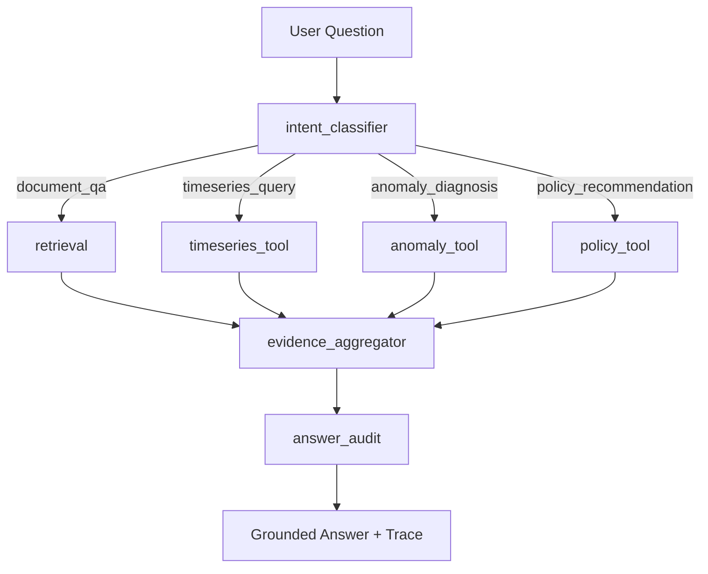

# DataCenter-HVAC Copilot

## LangGraph Trace Demo

- Copilot tab now lets you switch between `Deterministic baseline` and `LangGraph workflow`.
- `/ask` and Streamlit default to `workflow_engine=langgraph`, returning the real `workflow_trace`; `Deterministic baseline` remains selectable for comparison.
- Streamlit shows a `LangGraph Workflow Trace` panel summarizing step / node / route / classifier / tools / evidence / audit.

面向 **BEAR HVAC 物理仿真轨迹** 的 RAG + Tool Agent + Evaluation 项目，用于演示数据中心冷却优化类问题中的文档检索、时序分析、异常诊断、策略建议和可复现评测。

> 重要边界：BEAR 在本项目中只能表述为 HVAC 仿真环境 / 可控代理场景，不能伪装成真实数据中心生产遥测。LLM / Agent 只负责任务路由、证据整合和解释生成，不直接生成或写回控制动作。

## 项目亮点

- **不是普通 ChatPDF**：系统同时支持文档问答、BEAR-like 时序查询、异常诊断和策略建议。
- **RAG + Tool Agent 闭环**：问题先路由，再检索文档、调用时序工具或 policy 工具，最后基于证据生成回答。
- **多 LLM 后端可选接入**：`/ask` 支持 deterministic fallback、DeepSeek 和本地 Ollama evidence-grounded answer generation；未配置或调用失败时自动回退 deterministic generator。
- **控制边界清晰**：控制建议只来自 rule-based、MPC-like、DiffFNO / Guided-DiffFNO adapter 或 offline replay 等工具，LLM 不直接控制环境。
- **Safety Audit**：每个回答都会进行确定性安全审计，检查生产遥测误述、LLM 直接控制声明和未验证策略动作。
- **可复现评测**：内置 100 条 JSONL 评测集，覆盖文档问答、时序查询、异常诊断和策略建议，并生成 baseline comparison 和实验报告。
- **可展示 Demo**：FastAPI + Streamlit，包含典型案例 walkthrough、execution timeline、评测摘要和 prediction preview。

## 当前成熟度

项目已经超过 MVP 阶段，当前可以端到端运行：

- 文档加载、chunk、检索、rerank
- BEAR schema、processed CSV / BEAR sample CSV / mock fallback
- 时序工具和 policy adapter
- DeepSeek / Ollama / deterministic answer generator
- answer safety audit
- FastAPI 服务
- Streamlit demo
- 100 条评测集和 baseline comparison

当前更适合继续补的是展示材料、截图、Docker 启动体验、真实 embedding 检索和工作流增强，而不是重写核心架构。人工评测是可选增强项，不阻塞当前简历展示版本。

## 系统架构

```text
用户问题
  |
  v
Deterministic Router
  |
  +-- document_qa ---------> RAG Retriever / Reranker ----+
  |                                                       |
  +-- timeseries_query ----> Time-Series Tools -----------+
  |                                                       |
  +-- anomaly_diagnosis ---> Anomaly Tool ----------------+
  |                                                       |
  +-- policy_recommendation -> Policy Adapter ------------+
                                                          |
                                                          v
                                      Evidence-Grounded Answer Generator
                                                          |
                                                          v
                                               Answer Safety Audit
                                                          |
                                                          v
                                          FastAPI / Streamlit Demo
```

Stage 2 增加了 LangGraph workflow。交互式 `/ask` 和 Streamlit 默认使用 LangGraph 编排；`LANGGRAPH_INTENT_PROVIDER=auto` 时，如果检测到 `DEEPSEEK_API_KEY` 会自动启用 DeepSeek intent classifier，否则回退 rule-based。也可以显式配置 `LANGGRAPH_INTENT_PROVIDER=deepseek`、`ollama` 或 `rule_based`；LLM 输出非法或调用失败时自动回退 rule-based：



`langgraph_tool_agent` 与 deterministic `rag_tool_agent` 共享 `AgentTaskExecutor` 工具执行组件，因此默认指标对齐；它的价值是展示 StateGraph 编排、workflow trace，以及可替换的 LLM intent classifier 节点，而不是改变默认可复现评测口径。

核心模块：

```text
src/core/          共享 schema、字段来源、env loader
src/ingestion/     BEAR 轨迹标准化、BEAR adapter、processed/sample loader
src/retrieval/     文档加载、chunk、keyword / hybrid / rerank 检索、RAG baseline
src/tools/         时序查询、周期对比、异常检测、能耗拆分、趋势数据
src/policies/      rule-based、MPC-like、diffusion adapter、DROPT checkpoint adapter、offline replay
src/agent/         router、intent classifier、shared task executor、orchestrator、answer generator、DeepSeek/Ollama adapter、answer audit
src/evaluation/    eval loader、metrics、baseline runner、report、可选 judge adapter
src/api/           FastAPI 服务
app/               Streamlit demo
scripts/           评测和 BEAR 导出脚本
tests/             单元测试和 smoke tests
```

## 数据边界

当前 demo 轨迹数据按以下优先级加载：

1. `data/bear_processed/bear_rollout.csv`
2. `BEAR/BEAR/Data/Exercise2A-mytest.csv`
3. built-in mock trajectory

API 会返回只读 `data_source`，用于展示当前数据来自 processed CSV、BEAR sample CSV 还是 mock fallback。

字段使用原则：

- `zone_temperature`、`outdoor_temp`、`solar_irradiance`、`ground_temp`、`internal_load`、`control_action`、`reward`、`comfort_violation` 可来自 BEAR 或由 BEAR 轨迹可重复计算。
- `pue`、`humidity`、`it_load`、`chiller_power` 等不能默认视为 BEAR 原生字段。
- 没有可复现映射时，optional 字段不能编造。

## 环境安装

推荐使用 conda：

```bash
conda create -n hvac-copilot python=3.12
conda activate hvac-copilot
pip install -e ".[dev]"
```

如果已有 Python 环境：

```bash
pip install -e ".[dev]"
```

可选 FAISS dense retrieval：

```bash
pip install -e ".[dev,dense]"
```

FAISS 是本地向量索引库，本身不需要 API 或按次付费；`sentence-transformers` 会在本地生成 embedding，首次使用可能下载模型。当前 Stage 2 已用 `BAAI/bge-small-zh-v1.5` + FAISS 跑通真实 dense baseline。Qdrant 更偏生产化向量数据库和服务部署，当前保留在 Roadmap。

## 可选 DROPT / Guided-DiffFNO 策略后端

项目已支持本地 `models/dropt/policy_best_fno_guided.pth` checkpoint 的可选推理适配器：

- 代码入口：`src/policies/dropt_adapter.py`
- 策略名称：`dropt_guided_diffno_checkpoint`
- 输入要求：显式 20 维 BEAR state vector，布局为 `[zone_temperature(6), outdoor_temp(1), solar_irradiance(6), ground_temp(1), internal_load(6)]`
- 默认行为：`/eval/run` 和 `scripts/run_eval.py` 仍使用 deterministic rule-based policy，保证评测口径不变。
- 边界：该后端只作为 HVAC 仿真 / 可控代理场景中的离线策略工具，不是生产控制器；LLM 仍只解释 `policy_result`，不生成或写回控制动作。
- 失败语义：checkpoint 缺失、文件损坏、或 BEAR state 维度不完整时，适配器会明确回退到 rule-based policy，并在 `notes` 中写明原因。

代码中可通过 `build_demo_orchestrator(use_dropt_policy=True)` 显式启用该后端；如果 checkpoint 缺失或 state 不完整，会自动回退到 rule-based policy 并在 `notes` 中说明原因。

## LLM 后端配置

LLM answer generator 是可选能力。默认不配置时使用 deterministic evidence-grounded fallback；也可以在 shell 或项目根目录 `.env` 中选择 DeepSeek 或本地 Ollama。

DeepSeek 示例：

```bash
LLM_PROVIDER=deepseek
DEEPSEEK_API_KEY=your_key_here
DEEPSEEK_BASE_URL=https://api.deepseek.com
DEEPSEEK_MODEL=deepseek-chat
DEEPSEEK_TIMEOUT_SECONDS=30
```

Ollama 示例：

```bash
LLM_PROVIDER=ollama
OLLAMA_BASE_URL=http://localhost:11434
OLLAMA_MODEL=qwen2.5:7b
OLLAMA_TIMEOUT_SECONDS=60
```

LangGraph LLM intent classification 默认 auto：

```bash
LANGGRAPH_INTENT_PROVIDER=auto
```

检测到 `DEEPSEEK_API_KEY` 时，auto 会启用 DeepSeek intent classifier；未配置 key 时使用 rule-based。显式 DeepSeek 示例：

```bash
LANGGRAPH_INTENT_PROVIDER=deepseek
LANGGRAPH_INTENT_MODEL=deepseek-chat
LANGGRAPH_INTENT_TIMEOUT_SECONDS=20
```

本地 Qwen / Ollama intent classification 示例：

```bash
LANGGRAPH_INTENT_PROVIDER=ollama
LANGGRAPH_INTENT_MODEL=qwen2.5:7b
OLLAMA_BASE_URL=http://localhost:11434
LANGGRAPH_INTENT_TIMEOUT_SECONDS=20
```

显式使用 deterministic fallback：

```bash
LLM_PROVIDER=deterministic
LANGGRAPH_INTENT_PROVIDER=rule_based
```

说明：

- `.env` 会自动加载，但不会覆盖 shell 中已有环境变量。
- `/ask` 可使用 DeepSeek 或 Ollama 生成最终解释。
- `LANGGRAPH_INTENT_PROVIDER` 只影响 `workflow_engine=langgraph` 的意图分类节点；可选值为 `auto`、`rule_based`、`deepseek`、`ollama`。交互式 demo 默认 `auto`，评测脚本仍显式保持可复现口径。
- `scripts/run_eval.py` 和 `/eval/run` 默认使用 deterministic generator，避免批量 API 调用影响速度、成本和可复现性。
- LLM 后端只基于 `retrieved_contexts`、`citations`、`tool_results`、`policy_result` 和 `data_source` 写回答，不负责控制决策。

## 启动服务

启动 FastAPI：

```bash
uvicorn src.api.app:app --reload
```

可用接口：

- `GET /health`
- `POST /ask`
- `POST /eval/run`

启动 Streamlit：

```bash
streamlit run app/streamlit_app.py
```

Streamlit 默认连接 `http://localhost:8000`。如果 API 在其他容器或机器上，设置：

```bash
HVAC_COPILOT_API_BASE_URL=http://api:8000 streamlit run app/streamlit_app.py
```

## Docker 一键启动

本项目提供 `Dockerfile` 和 `docker-compose.yml`，用于本地演示 API + Streamlit：

```bash
docker compose up --build
```

启动后访问：

- FastAPI: `http://localhost:8000/health`
- Streamlit: `http://localhost:8501`

`docker-compose.yml` 会为 Streamlit 设置 `HVAC_COPILOT_API_BASE_URL=http://api:8000`，因此容器内不会错误连接自己的 `localhost`。如果本地 `.env` 存在，compose 会把 DeepSeek 等可选配置传入容器；`.env` 不应提交到仓库。

Streamlit 包含：

- 专业深色控制台布局：左侧 Mission Control 输入区，右侧 Grounded Answer、状态卡片和结构化证据区，便于面试截图展示。
- Copilot tab：输入问题、选择任务类型、查看回答、route、tools、answer generator、evidence、audit、data source。
- 典型案例 walkthrough：BEAR 数据边界、温度时序查询、策略建议边界。
- Execution Timeline：展示 Route、Retrieval、Tool Call、Answer Generator、Data Boundary。
- Safety Audit：展示回答是否触发边界风险。
- 评测摘要 tab：调用 `/eval/run`，展示 Retrieval / Answer / Tool / Quality Proxy 指标和 prediction preview。

## 面试演示路径

推荐 5 到 8 分钟演示顺序：

1. 启动 API 和 Streamlit。
2. 在 Copilot tab 选择 `BEAR 数据边界`，展示 RAG 引用和数据边界。
3. 选择 `温度时序查询`，展示 router 调用 `query_metric` 和 metric summary。
4. 选择 `策略建议边界`，展示 policy tool 输出和 LLM 不直接控制。
5. 展示 Execution Timeline 和 Safety Audit。
6. 打开评测摘要 tab，说明 100 条 eval 和 baseline comparison。

详细讲解脚本见：[docs/demo_walkthrough.md](docs/demo_walkthrough.md)

## 测试

日常测试：

```bash
python -m pytest -q
```

当前测试覆盖包括：

- BEAR schema / adapter / loader
- time-series tools
- policy adapters
- retrieval / RAG
- orchestrator
- DeepSeek / Ollama answer generator
- answer safety audit
- API
- Streamlit helper
- evaluation metrics / report
- optional LLM judge adapter

日常 pytest 使用小型 eval fixture，避免每次开发都运行完整 100 条评测。

## 评测

完整 100 条评测：

```bash
python scripts/run_eval.py
```

真实 BGE + FAISS dense baseline：

```bash
python scripts/run_eval.py --dense-provider sentence-transformers --dense-backend faiss --dense-model BAAI/bge-small-zh-v1.5
```

Intent routing 单独对比：

```bash
python scripts/run_intent_eval.py --providers rule_based
python scripts/run_intent_eval.py --providers rule_based ollama
python scripts/run_intent_eval.py --providers rule_based deepseek
```

该脚本输出 `data/eval/intent_routing_comparison.json`，包含 intent routing accuracy、fallback rate、按任务类型分组指标和 confusion matrix。DeepSeek 会在缺少 `DEEPSEEK_API_KEY` 时标记为 skipped；Ollama 调用失败时会回退 rule-based，并通过 `fallback_rate` 暴露出来。

Query Rewrite / HyDE baseline：

当前 `run_eval.py` 已纳入 deterministic query expansion 对比，不依赖 API key 或模型下载：

- `rag_rewrite`：用规则扩展 HVAC/BEAR 查询词，例如 `query_metric`、`zone_temperature`、`policy_result`。
- `rag_hyde`：用 template HyDE 生成 hypothetical evidence document，再执行检索。
- `rag_hyde_rerank`：在 template HyDE 检索后复用轻量 reranker。

这些 baseline 用于对比 raw query、rewrite 和 HyDE 的检索效果；后续可以把 template HyDE generator 替换为 DeepSeek / Ollama 生成器。

该脚本会生成：

- `data/eval/baseline_predictions.jsonl`
- `data/eval/baseline_comparison.json`
- `docs/experiment_report.md`

当前评测集包含 100 条样例：

```text
document_qa:          40
timeseries_query:     20
anomaly_diagnosis:    20
policy_recommendation:20
```

baseline 包含：

- `llm_only`
- `rag_keyword`
- `rag_dense`
- `rag_hybrid`
- `rag_hybrid_rerank`
- `rag_rewrite`
- `rag_hyde`
- `rag_hyde_rerank`
- `rag`
- `rag_tool_agent`

核心指标：

- `citation_hit_rate`
- `context_recall`
- `expected_keyword_coverage`
- `lexical_answer_coverage`
- `tool_selection_accuracy`
- `tool_execution_success_rate`
- `evidence_coverage`
- `answer_correctness_proxy`
- `faithfulness_proxy`

最新默认评测中，`rag_tool_agent` 结果为：

```text
tool_selection_accuracy        = 1.000
tool_execution_success_rate    = 1.000
evidence_coverage              = 0.910
expected_keyword_coverage      = 0.618
answer_correctness_proxy       = 0.547
faithfulness_proxy             = 0.465
```

最新 Stage 2 真实 dense 检索运行中，`rag_dense` 使用 `BAAI/bge-small-zh-v1.5` + FAISS，整体结果为：

```text
citation_hit_rate              = 0.692
context_recall                 = 0.692
expected_keyword_coverage      = 0.528
answer_correctness_proxy       = 0.654
faithfulness_proxy             = 0.566
```

在当前 100 条评测集上，真实 dense 检索的 citation/context 高于 `rag_keyword` 的 0.554、`rag_hybrid` 的 0.585 和 `rag_hybrid_rerank` 的 0.600；`rag_tool_agent` 的优势主要体现在工具选择、工具执行和结构化证据覆盖。

Stage 2 LangGraph workflow 已纳入 baseline comparison：

```text
langgraph_tool_agent tool_selection_accuracy      = 1.000
langgraph_tool_agent tool_execution_success_rate  = 1.000
langgraph_tool_agent evidence_coverage            = 0.910
langgraph_tool_agent answer_correctness_proxy     = 0.547
langgraph_tool_agent faithfulness_proxy           = 0.465
```

`langgraph_tool_agent` 与 deterministic `rag_tool_agent` 指标一致，说明默认 LangGraph 版本没有改变底层工具行为；它用于展示 workflow 编排、trace 和可选 LLM intent classification。独立 intent routing 评测显示，默认 keyword/rule-based classifier 在 100 条样例上 accuracy 为 0.640；这也是需要接入 DeepSeek 或本地 Qwen/Ollama intent classifier 做对比的原因。

## 评测口径

当前阶段默认采用三层评测口径：

1. **Deterministic metrics**：默认主报告，包含 citation/context、tool selection/execution、evidence coverage、expected keyword coverage 等可复现指标。
2. **Quality proxy**：基于 `expected_keywords`、`must_include`、`must_not_include` 的本地弱监督指标，用于快速比较回答覆盖和边界风险。
3. **LLM-as-Judge / Human Calibration**：可选增强项。可以用 LLM judge 辅助评估 correctness / faithfulness，但必须明确标注为 LLM-as-Judge；人工评测可以以后再补，不作为当前阶段必须项。

不要把 deterministic proxy 或 LLM judge 说成人工评测。

## 可选 LLM Judge

LLM judge adapter 默认关闭。默认报告只使用 deterministic metrics，保证可复现。

显式开启 smoke judge：

```bash
python scripts/run_eval.py --enable-llm-judge --llm-judge-provider deterministic
```

开启后会额外输出：

- `llm_judge_correctness`
- `llm_judge_faithfulness`

注意：当前 `deterministic` provider 只是接口 smoke provider，不替代人工评审，也不作为默认主指标。后续如果接入 DeepSeek / Qwen judge，报告和简历都应写成 LLM-as-Judge，而不是人工评审。

## 人工评测校准

人工评测是可选增强项，不阻塞当前简历展示版本。`scripts/run_eval.py` 会生成 `data/eval/human_review_sample.jsonl` 和 `data/eval/human_review_annotations.jsonl`。前者是待审样例，后者由人工填写 correctness / faithfulness / safety boundary。标注指南见 `docs/human_evaluation_guide.md`。

在人工填写前，实验报告的 Human Calibration 小节显示 `pending_human_review` 是正常状态；README 和简历只强调 deterministic metrics / quality proxy / optional LLM-as-Judge。填写完成后重新运行 `python scripts/run_eval.py`，报告会读取已有 `human_review_annotations.jsonl` 并更新 Human Calibration 小节。

## BEAR Rollout 导出

如果需要从外部 BEAR 仓库导出 rollout：

```bash
git clone https://github.com/chz056/BEAR.git ../BEAR
pip install -r ../BEAR/requirements.txt
python scripts/export_bear_data.py --bear-root ../BEAR --num-steps 336 --scenario-id bear_officesmall_tucson_14d_random --output data/bear_processed/bear_rollout.csv
```

如果使用你的完整 DROPT 源码仓库，可以直接把 `--bear-root` 指向其中的 `BEAR` 子目录，例如：

```bash
python scripts/export_bear_data.py --bear-root C:\Users\zouwei\Desktop\PROJECT\_external\DROPT\BEAR --num-steps 336 --scenario-id bear_officesmall_tucson_14d_random --output data/bear_processed/bear_rollout.csv
```

当前项目已用 DROPT 中的完整 BEAR 环境导出一份 14 天逐小时、6 zone 的 processed rollout，共 2016 行。demo 会优先加载 `data/bear_processed/bear_rollout.csv`，API 的 `data_source.kind` 应显示 `processed_csv`。这仍然是 BEAR HVAC 仿真 rollout，不是数据中心生产遥测。

导出脚本使用：

- `BuildingEnvReal.reset()`
- `BuildingEnvReal.step(action)`
- `env.statelist`
- `env.actionlist`

映射的 BEAR state 布局：

```text
[zone_temperature(n), outdoor_temp(1), solar_irradiance/GHI(n), ground_temp(1), occupancy_power(n)]
```

## 当前完成情况

已完成：

- BEAR schema 和字段来源约束
- processed CSV / BEAR sample CSV / mock fallback
- BEAR adapter 接入真实 `BuildingEnvReal.reset()` / `step()` / `statelist` / `actionlist`
- 时序工具：`query_metric`、`compare_period`、`detect_anomaly`、`compute_energy_breakdown`、`plot_metric_trend`
- policy adapter：rule-based、MPC-like placeholder、diffusion adapter 边界、DROPT Guided-DiffFNO checkpoint adapter、offline replay
- 多文档 RAG：Markdown/TXT loader、chunk、Keyword、Hybrid、Reranking retriever
- deterministic router + baseline orchestrator
- LangGraph StateGraph workflow + DeepSeek/Ollama optional LLM intent classifier
- shared AgentTaskExecutor for baseline and LangGraph tool execution
- DeepSeek / Ollama evidence-grounded answer generator
- deterministic fallback answer generator
- answer safety audit
- FastAPI `/health`、`/ask`、`/eval/run`
- Streamlit Copilot / 评测摘要双 tab
- 100 条 eval JSONL、baseline comparison 和 intent routing comparison
- optional LLM judge adapter smoke provider
- demo walkthrough 文档

## 后续 Roadmap

建议下一步：

- README / demo 截图素材
- 更强 prompt 审计样例
- README / demo 截图素材

长期加分项：

- Qdrant 向量数据库服务化检索
- cross-encoder / neural / LLM reranker
- 更完整的 DiffFNO / Guided-DiffFNO offline replay 指标和策略对比
- 更完整的人工 correctness / faithfulness 标注
- 150 到 200 条更大规模 eval

## 一句话简历表达

构建 DataCenter-HVAC Copilot：基于 BEAR HVAC 仿真轨迹，设计 RAG + Tool Agent + Evaluation 系统，支持文档问答、时序查询、异常诊断和策略建议；实现 DeepSeek evidence-grounded answer generation、answer safety audit、时序工具、policy adapter 边界、FastAPI/Streamlit demo 和 100 条评测集，并通过多 baseline comparison 验证检索、工具调用、证据覆盖和回答质量代理指标。
