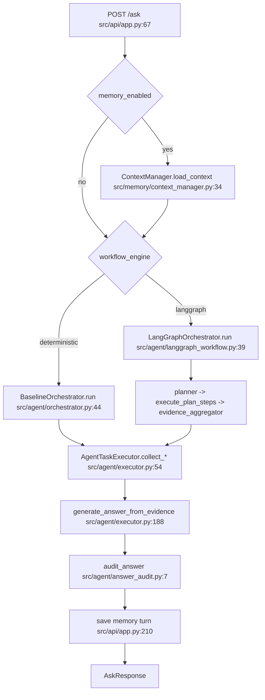

本文件回答：项目长什么样、规模多大、一次 `/ask` 会经过哪些代码、各模块负责什么。

# 项目快照

## A. 仓库结构

顶层结构：

```text
.
├─ app/                    Streamlit UI 与 HTTP API client；入口 app/streamlit_app.py:1241
├─ src/                    后端核心代码：agent、RAG、memory、knowledge、evaluation、API
│  ├─ agent/               路由、LangGraph workflow、工具执行、回答生成与审计
│  ├─ api/                 FastAPI app、Pydantic schema、demo orchestrator factory
│  ├─ core/                env loader、通用 schema、文本切分辅助
│  ├─ evaluation/          JSONL eval、baseline runner、metrics、报告、人审模板
│  ├─ ingestion/           BEAR/processed CSV 加载与轨迹标准化
│  ├─ knowledge/           上传文档解析、SQLite metadata、FAISS index、retriever
│  ├─ memory/              SQLite conversation memory、turn indexing、session 检索
│  ├─ policies/            rule-based/MPC-like/offline/DROPT policy adapter
│  ├─ retrieval/           文档 loader、keyword/hybrid/dense/FAISS/RAG/query rewrite
│  └─ tools/               pandas 时序查询、异常检测、能耗拆分、趋势数据
├─ data/                   demo documents、BEAR processed rollout、eval JSONL/结果
├─ docs/                   demo walkthrough、实验报告、设计/复盘/计划文档
├─ scripts/                run_eval、intent_eval、compound eval 生成、BEAR 导出
├─ tests/                  43 个测试文件，pytest collect 259 tests
├─ BEAR/                   vendored BEAR 样例数据和上游参考代码
├─ models/dropt/           Guided-DiffFNO checkpoint 与原始模型文件
└─ .github/workflows/      CI：ruff + pytest，见 .github/workflows/ci.yml:20
```

`src/` 文件清单：

- `agent/`: `router.py` deterministic route；`planner.py` PlanStep/LLMRoutePlanner；`langgraph_workflow.py` StateGraph 编排；`orchestrator.py` deterministic baseline；`executor.py` RAG/tool/policy 共享执行；`answer_generator.py` deterministic grounded answer；`deepseek_generator.py`/`ollama_generator.py` LLM backend；`answer_audit.py` guardrail；`intent_classifier.py` 独立 intent eval；`react_agent.py` 另一个多步 baseline。
- `api/`: `app.py` FastAPI endpoints；`schemas.py` request/response schema；`demo_factory.py` 构建 demo RAG、trajectory、policy backend。
- `core/`: `env.py` `.env` loader；`schemas.py` 字段来源 schema；`text_chunking.py` 通用 token chunking。
- `evaluation/`: `dataset.py` EvalRecord；`runner.py` baseline comparison；`metrics.py` deterministic metrics；`report.py` Markdown 报告；`human_review.py` 人审样本/模板；`llm_judge.py` smoke judge；`safety_adversarial.py` safety audit 数据集；`compound_task_generator.py` 多步 planner eval 数据生成；`intent_routing.py` intent 对比；`policy_benchmark.py` policy 后端 benchmark。
- `ingestion/`: `bear_adapter.py` 连接 `BuildingEnvReal` 并导出 rollout；`bear_schema.py` 标准字段；`bear_sample_loader.py` 上游样例 CSV；`processed_loader.py` processed CSV。
- `knowledge/`: `parsers.py` PDF/DOCX/TXT/MD；`chunking.py` parsed doc chunk；`storage.py` SQLite metadata；`indexer.py` FAISS + sidecar + manifest；`retriever.py` 持久化检索；`service.py` 上传/删除/reindex 编排；`schemas.py` 数据结构。
- `memory/`: `storage.py` sessions/turns/chunks SQLite；`context_manager.py` API 边界；`indexer.py` turn -> chunk；`retriever.py` session-scoped retrieval；`budget.py` 上下文预算；`stable_context.py` 固定边界；`schemas.py` 数据结构。
- `policies/`: `base.py` PolicyResult；`rule_based.py` fallback；`mpc_like.py` deterministic placeholder；`diffusion_adapter.py` adapter stub；`dropt_adapter.py` torch checkpoint inference；`offline_replay.py` replay backend。
- `retrieval/`: `loader.py` demo docs；`chunking.py` chunk；`retriever.py` keyword/hybrid/rerank；`dense.py` dense baseline；`faiss_retriever.py` FAISS dense；`embeddings.py` hash/sentence-transformers；`rag.py` extractive/grounded RAG；`query_rewrite.py` rewrite/HyDE；`schemas.py` chunks。
- `tools/`: `timeseries.py` `query_metric`、`compare_period`、`detect_anomaly`、`compute_energy_breakdown`、`plot_metric_trend`。

代码规模（非空非注释 Python 行；测试行按测试文件名近似归属，可能一测试服务多个模块）：

| 子目录 | 代码行 | 关联测试行 | py 文件数 |
|---|---:|---:|---:|
| `src/agent` | 1970 | 1498 | 12 |
| `src/api` | 648 | 1046 | 4 |
| `src/core` | 88 | 33 | 4 |
| `src/evaluation` | 1591 | 1488 | 11 |
| `src/ingestion` | 387 | 242 | 5 |
| `src/knowledge` | 1170 | 966 | 8 |
| `src/memory` | 798 | 442 | 8 |
| `src/policies` | 520 | 170 | 7 |
| `src/retrieval` | 667 | 412 | 10 |
| `src/tools` | 174 | 77 | 2 |
| `app` | 1428 | 576 | 3 |
| `scripts` | 444 | 45 | 4 |
| `tests` | 6708 | - | 43 |

## B. 技术栈

- LLM 接入：DeepSeek 用 `urllib.request`，见 `src/agent/deepseek_generator.py:7`、`src/agent/deepseek_generator.py:55`；Ollama 同样 HTTP，见 `src/agent/ollama_generator.py:33`。`LLM_PROVIDER`、`DEEPSEEK_API_KEY`、`OLLAMA_*` 在 `.env.example:17` 和 `.env.example:24`。
- 检索向量：`faiss-cpu`、`sentence-transformers` 是 optional dense 依赖，见 `pyproject.toml:26`；实际 import 在 `src/retrieval/faiss_retriever.py:20`、`src/retrieval/embeddings.py:33`、`src/knowledge/indexer.py:35`。
- Web UI/API：FastAPI 依赖在 `pyproject.toml:8`，入口 `src/api/app.py:35`；Streamlit 依赖在 `pyproject.toml:17`，入口 `app/streamlit_app.py:1241`；Streamlit client 实际 import `httpx` 于 `app/api_client.py:5`，但 `pyproject.toml` 未列出 `httpx`。
- 评测：Pydantic EvalRecord 在 `src/evaluation/dataset.py:1`；baseline runner 在 `src/evaluation/runner.py:46`；metrics 在 `src/evaluation/metrics.py:10`；报告生成在 `src/evaluation/report.py:25`。
- 开发工具：pytest/ruff 在 `pyproject.toml:21`；CI 执行 `python -m ruff check .` 和 `python -m pytest -q`，见 `.github/workflows/ci.yml:23`。
- 其他实际依赖：torch/numpy 用于 DROPT，见 `src/policies/dropt_adapter.py:8`；`torch` 未列在 `pyproject.toml`。PDF/DOCX parser 用 `pypdf`/`python-docx`，见 `src/knowledge/parsers.py:97`、`src/knowledge/parsers.py:115`。

入口点：FastAPI app 是 `src.api.app:app`，实例化在 `src/api/app.py:497`；Streamlit 是 `streamlit run app/streamlit_app.py`，main 在 `app/streamlit_app.py:1524`；CLI 脚本包括 `scripts/run_eval.py:46`、`scripts/run_intent_eval.py:26`、`scripts/generate_compound_eval.py:23`、`scripts/export_bear_data.py:17`。

## C. 主调用链

`/ask` 入口在 `src/api/app.py:67`。共同前置逻辑：尝试刷新 knowledge index，然后按 `memory_enabled` 初始化/读取 session memory（`src/api/app.py:69`、`src/api/app.py:76`、`src/api/app.py:120`）。

Deterministic 路径：

1. `src/api/app.py:174` 根据 `workflow_engine=="deterministic"` 调 `BaselineOrchestrator.run`。
2. `src/agent/orchestrator.py:44` 调 `route_task`，按 route 分派到 `run_document_qa` / `run_timeseries_query` / `run_anomaly_diagnosis` / `run_policy_recommendation`。
3. `src/agent/orchestrator.py:67` 等方法调用 `AgentTaskExecutor.collect_*_evidence`。
4. `src/agent/executor.py:188` 用 `answer_generator.generate` 生成回答，并在 `src/agent/executor.py:212` 调 `audit_answer`。
5. `src/api/app.py:197` 合并 memory trace；`src/api/app.py:210` 保存 turn；`src/api/app.py:274` 返回响应。

LangGraph 路径：

1. `src/api/app.py:185` 调 `LangGraphOrchestrator.run`。
2. `src/agent/langgraph_workflow.py:45` `graph.invoke`；graph 节点定义在 `src/agent/langgraph_workflow.py:59`。
3. planner 节点 `src/agent/langgraph_workflow.py:75` 调 route planner；LLM planner 失败时 fallback 在 `src/agent/planner.py:194`。
4. `execute_plan_steps` 在 `src/agent/langgraph_workflow.py:110` 循环执行 `collect_*_evidence`，单步分派见 `src/agent/langgraph_workflow.py:136`。
5. `evidence_aggregator` 合并证据于 `src/agent/langgraph_workflow.py:147`；`answer_generator` 于 `src/agent/langgraph_workflow.py:176`；`answer_audit` 于 `src/agent/langgraph_workflow.py:195`。
6. API 保存 memory 并返回，同 deterministic。



## D. 模块速览

`agent` 是真实核心，不只是包装。`AgentTaskExecutor` 统一 RAG、timeseries、policy evidence 收集，避免 LangGraph 与 baseline 两套工具逻辑分裂（`src/agent/executor.py:27`）。`LangGraphOrchestrator` 是线性 StateGraph，多步规划受控但不是复杂 autonomous agent（`src/agent/langgraph_workflow.py:59`）。

`api` 是可运行服务层。`create_app` 同时持有 deterministic 和 LangGraph orchestrator（`src/api/app.py:35`），并把 memory、knowledge refresh、eval、upload 都放在同一 FastAPI app。实现有实际错误处理，但文件较大，`/ask` 分支较长。

`core` 很薄，主要提供 `.env` loader、字段来源 schema 和 chunking helper。`load_env_file` 明确不覆盖已有 shell 环境变量（`src/core/env.py:7`），适合本地 demo 配置。它不是业务核心。

`ingestion` 能加载 processed rollout、BEAR sample、mock fallback，并有 `BuildingEnvReal` 导出接口（`src/ingestion/bear_adapter.py:29`、`scripts/export_bear_data.py:30`）。这部分是真实数据边界实现，不是只在 README 声明。弱点是外部 BEAR 导出流程本次未验证。

`retrieval` 覆盖 lexical、hybrid、rerank、dense、FAISS、query rewrite 和 template HyDE。`KeywordRetriever`/`HybridRetriever` 是轻量本地实现（`src/retrieval/retriever.py:14`、`src/retrieval/retriever.py:59`），不是生产搜索服务；FAISS dense 是真实可选后端（`src/retrieval/faiss_retriever.py:20`）。

`knowledge` 是较扎实的持久化知识库。它支持文件上传、解析、SQLite metadata、FAISS index、manifest 校验和原子替换（`src/knowledge/service.py:52`、`src/knowledge/indexer.py:34`）。当前 rebuild 是全量，不是增量。

`memory` 是 session 级 SQLite memory，不是简单前端缓存。`ConversationMemoryStore` 保存 sessions/turns/chunks（`src/memory/storage.py:16`），`ContextManager` 加载最近 turns、检索 memory、套预算（`src/memory/context_manager.py:34`）。默认 dense memory 若依赖不可用会标 unavailable，除非显式允许 fallback（`src/memory/retriever.py:32`）。

`tools` 是 pandas 工具集合，功能明确但算法偏规则/统计级别。`query_metric` 返回 summary 和 records（`src/tools/timeseries.py:52`），`detect_anomaly` 使用滑窗均值/标准差（`src/tools/timeseries.py:99`）。它支撑“不是纯 ChatPDF”的演示。

`policies` 有 rule-based、offline replay、MPC-like placeholder、Diffusion stub 和真实 torch DROPT checkpoint adapter。DROPT adapter 能加载 checkpoint 并 deterministic sample（`src/policies/dropt_adapter.py:363`、`src/policies/dropt_adapter.py:419`），但策略效果评价仍薄。

`evaluation` 是简历项目里比较重的一块。它有 108 条主 eval、15 个 baseline summary、metrics/report/human review/safety adversarial/DROPT benchmark；实际报告见 `docs/experiment_report.md:5`、`docs/experiment_report.md:16`。弱点是 correctness/faithfulness 主要是 proxy，人审模板 24 条全空（`docs/experiment_report.md:99`）。
