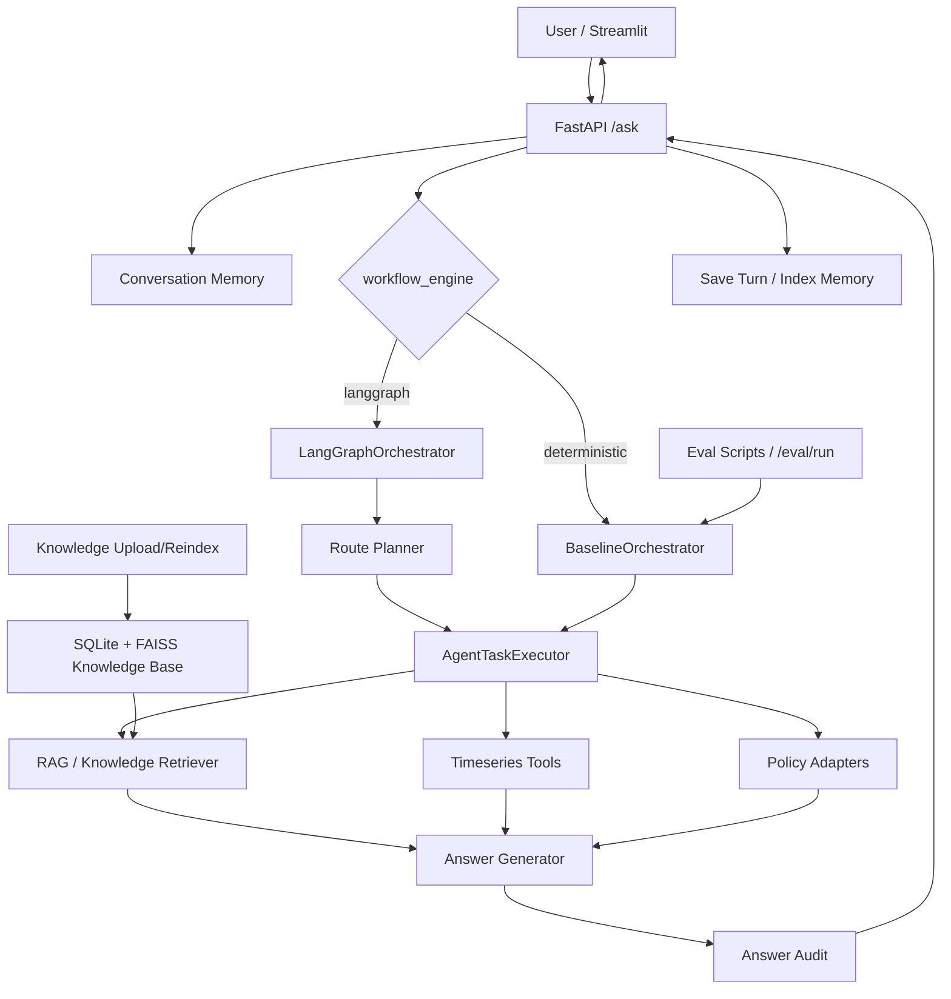

# DataCenter-HVAC Copilot 技术审查文档

## 项目概述

DataCenter-HVAC Copilot 是一个面向 BEAR HVAC 仿真轨迹的数据中心冷却分析 Copilot。项目不是普通 ChatPDF，而是把文档检索、时序数据分析、异常诊断、策略建议、会话记忆和可复现实验评测组合成一个 RAG + Tool Agent 系统。核心功能包括：运维文档检索问答、BEAR/processed CSV 轨迹查询、异常诊断、策略工具调用、DeepSeek/Ollama/确定性回答生成、Safety Audit、持久化知识库、会话记忆、FastAPI 服务、Streamlit Demo 和多 baseline 评测。

审查依据：仓库共有 `255` 个文件。抽样验证中，完整 `python -m pytest -q` 在 `124040 ms` 后超时；代表性子集 `tests/test_timeseries_tools.py tests/test_policies.py tests/test_retrieval_pipeline.py tests/test_api_app.py` 通过，结果为 `48 passed`。

## 整体架构



整体设计思路是“LLM 只负责路由、证据整合和解释，不直接控制环境”。系统入口是 FastAPI 和 Streamlit；编排层分为 deterministic baseline 与 LangGraph workflow；工具层负责文档检索、时序计算和策略输出；回答生成层基于证据生成自然语言；审计层检查 BEAR 数据边界和控制动作边界；评测层对检索、工具调用、回答覆盖和 planner 进行可复现评估。

## 目录结构说明

```text
.
├── app/                         Streamlit 前端与 API client
├── src/
│   ├── api/                     FastAPI 应用、请求响应 schema、demo 依赖装配
│   ├── agent/                   路由、planner、LangGraph、executor、回答生成、审计、LLM adapter
│   ├── core/                    通用 schema、字段来源、.env loader
│   ├── ingestion/               BEAR/processed CSV 数据标准化与导出 adapter
│   ├── knowledge/               持久化知识库：解析、chunk、SQLite、FAISS、service
│   ├── memory/                  会话记忆：SQLite、turn index、检索、上下文预算
│   ├── policies/                rule-based、MPC-like、DROPT、offline replay、diffusion 边界
│   ├── retrieval/               文档 schema、加载、chunk、keyword/hybrid/dense/FAISS/RAG
│   ├── tools/                   时序工具
│   └── evaluation/              eval dataset、metrics、runner、report、judge、human review
├── scripts/                     评测、intent eval、BEAR 导出、compound eval 生成脚本
├── tests/                       单元测试与集成测试
├── data/                        文档、评测集、BEAR processed/raw、memory 占位
├── docs/                        设计、实验报告、handoff、计划与复盘文档
├── BEAR/                        外部 BEAR 示例代码、数据、notebook、图片
├── models/dropt/                Guided-DiffFNO/DROPT checkpoint 与训练脚本
├── Dockerfile                   API 容器镜像
├── docker-compose.yml           API + Streamlit 组合启动
├── pyproject.toml               Python 项目依赖、pytest、ruff 配置
└── README.md                    项目说明与运行方式
```

关键文件职责：

- `src/api/app.py`：定义 `/health`、`/ask`、`/eval/run`、`/knowledge/*`；处理 memory、knowledge refresh、workflow 选择。
- `src/api/demo_factory.py`：装配 demo orchestrator，加载 RAG、轨迹数据、回答生成器和 policy runner。
- `src/agent/orchestrator.py`：确定性 baseline 编排器。
- `src/agent/langgraph_workflow.py`：LangGraph 多步 planner -> executor -> evidence aggregator -> answer -> audit。
- `src/agent/executor.py`：共享任务执行逻辑，调用 RAG、时序工具、policy，并生成答案。
- `src/agent/planner.py`：确定性 planner 与 DeepSeek LLM route planner，限制最多 3 步。
- `src/agent/router.py`：简单规则路由。
- `src/agent/answer_generator.py`：确定性 evidence-only 回答生成。
- `src/agent/deepseek_generator.py`、`src/agent/ollama_generator.py`：可选 LLM 回答生成 adapter。
- `src/agent/answer_audit.py`：边界审计，检查生产遥测误称、LLM 直接控制、未验证策略动作。
- `src/retrieval/*`：传统 RAG 与 dense/FAISS 检索实现。
- `src/knowledge/*`：上传文档解析、SQLite metadata、FAISS index、manifest 校验。
- `src/memory/*`：会话、turn、memory chunk、检索和上下文预算。
- `src/tools/timeseries.py`：`query_metric`、`compare_period`、`detect_anomaly`、`compute_energy_breakdown`、`plot_metric_trend`。
- `src/policies/*`：策略输出接口与多种策略实现。
- `src/ingestion/*`：BEAR 轨迹标准字段与导出/加载。
- `src/evaluation/*`：评测数据结构、指标、baseline comparison、报告、人评模板、安全对抗集。
- `app/streamlit_app.py`：三页 Demo：Copilot、Knowledge Base、评测摘要。
- `app/api_client.py`：Streamlit 调 FastAPI 的 http client 封装。
- `scripts/run_eval.py`：运行 baseline comparison、保存预测、人评样本和实验报告。
- `scripts/run_intent_eval.py`：比较 rule-based/DeepSeek/Ollama intent routing。
- `scripts/export_bear_data.py`：从 BEAR 环境导出 rollout。
- `scripts/generate_compound_eval.py`：用 LLM 生成并校验 compound task eval。
- `tests/`：覆盖 API、agent、retrieval、knowledge、memory、policy、evaluation、Streamlit helper 等。

## 核心模块详解

### 1. API 层

输入：HTTP 请求。主要 schema 在 `src/api/schemas.py`。

`POST /ask` 输入包含：

```json
{
  "question": "string",
  "task_type": "optional route",
  "workflow_engine": "langgraph",
  "session_id": "optional",
  "memory_enabled": true
}
```

输出包含回答、路由、工具、引用、证据、policy result、workflow trace、memory status、session/turn id、knowledge refresh 状态。

核心流程：

1. 尝试刷新 dirty knowledge。
2. 如果启用 memory，加载或创建 session。
3. 根据 `workflow_engine` 调用 baseline 或 LangGraph。
4. 生成 workflow trace。
5. 保存 turn 到 SQLite，并索引成 memory chunk。
6. 返回结构化结果。

`POST /eval/run` 使用 deterministic answer generator 和 rule-based policy，避免评测被外部 LLM 或 DROPT 后端影响。

`/knowledge/*` 支持上传、列表、状态、重建索引和删除文档。

### 2. Agent 编排层

`BaselineOrchestrator` 根据 `route_task()` 得到单一路由，再调用 `AgentTaskExecutor`。

`LangGraphOrchestrator` 使用 `StateGraph`：

```text
planner
  -> execute_plan_steps
  -> evidence_aggregator
  -> answer_generator
  -> answer_audit
```

`planner.py` 支持：

- `DeterministicRoutePlanner`：规则推断或使用显式 `task_type`。
- `LLMRoutePlanner`：调用 OpenAI-compatible `/chat/completions`，但只接受受控 JSON schema。
- 计划限制：最多 3 步；route 只能是 `document_qa`、`timeseries_query`、`anomaly_diagnosis`、`policy_recommendation`；policy 必须最后一步。

### 3. AgentTaskExecutor

`src/agent/executor.py` 是工具调用的中心。

输入：问题、路由原因、可选 step spec。

输出：统一 evidence dict，之后交给 answer generator。

主要分支：

- `collect_document_qa_evidence()`：调用 RAG pipeline，返回 citations 和 retrieved contexts。
- `collect_timeseries_query_evidence()`：选择 metric、zone、time window 和工具。
- `collect_anomaly_diagnosis_evidence()`：调用 `detect_anomaly()`。
- `collect_policy_recommendation_evidence()`：提取 latest policy state，调用 policy runner。
- `generate_answer_from_evidence()`：调用回答生成器，再做 audit。

时间窗口支持 `full_demo_range`、`latest`、`recent`、`last_N_hours`、`last_N_minutes`，非法值回退到 full demo range 并写入 notes。

### 4. Retrieval 与 RAG

`src/retrieval/` 提供轻量本地检索能力：

- `loader.py`：加载 `.md` / `.txt`。
- `chunking.py`：按词切分 chunk，保留 citation metadata。
- `KeywordRetriever`：TF-IDF 风格词频检索。
- `HybridRetriever`：BM25-style 检索。
- `RerankingRetriever`：基于 phrase hit、coverage、metadata 的二阶段重排。
- `DenseRetriever`：内存向量点积检索，默认 hash embedding。
- `FaissDenseRetriever`：FAISS-backed dense retrieval。
- `ExtractiveRAGPipeline`：直接拼接 retrieved context。
- `GroundedRAGPipeline`：检索和回答生成分离。
- `query_rewrite.py`：规则 query expansion 与 template HyDE baseline。

### 5. 持久化知识库

`src/knowledge/` 支持上传 `.md`、`.txt`、`.pdf`、`.docx`。

核心流程：

1. `parse_document()` 解析文本，PDF 优先 PyMuPDF，fallback 到 pypdf；DOCX 使用 python-docx。
2. `chunk_parsed_document()` 按词切分。
3. `KnowledgeBaseStore` 用 SQLite 保存 document、chunk、index metadata。
4. `KnowledgeFaissIndexer` 全量 rebuild FAISS，并写 sidecar `chunks.jsonl` 与 `manifest.json`。
5. `PersistentKnowledgeRetriever` 加载 FAISS 前校验 manifest hash、FAISS row count 和 sidecar 行数。
6. `KnowledgeBaseService` 统一提供 ingest、delete、reindex、status、retriever。

设计上 SQLite 是 metadata source of truth，FAISS 是可重建派生索引。

### 6. 会话记忆

`src/memory/` 负责多轮上下文。

- `ConversationMemoryStore`：SQLite 保存 session、turn、memory chunks。
- `TurnMemoryIndexer`：把完整 turn 压缩成一条可检索 memory chunk。
- `build_memory_retriever()`：支持 `faiss_dense`、`dense_memory`、`hybrid`、`hybrid_rerank`。
- `FilteringMemoryRetriever`：按 `session_id` 过滤，避免跨会话泄漏。
- `ContextBudgetManager`：按字符预算截断 summary、recent turns、retrieved memory。
- `ContextManager`：API 层使用的高级封装。

memory 只用于指代消解和上下文连续性；当前 RAG、工具和 policy 输出仍是回答的最高优先级证据。

### 7. 时序工具

`src/tools/timeseries.py` 提供确定性工具：

- `query_metric()`：按时间、zone 和 metric 过滤，返回 summary 和 records。
- `compare_period()`：比较两个时间段均值差异和百分比变化。
- `detect_anomaly()`：滚动窗口 z-score/绝对偏差异常检测。
- `compute_energy_breakdown()`：汇总 cooling/fan/chiller power；若缺失则 fallback 到 `hvac_power`。
- `plot_metric_trend()`：返回折线图数据，不直接生成图片。

### 8. Policy 层

`src/policies/` 统一返回 `PolicyResult`。

- `rule_based.py`：基于舒适温度上下界输出增冷/放松/保持。
- `mpc_like.py`：确定性 MPC-like placeholder，返回能耗和舒适风险估计。
- `diffusion_adapter.py`：DiffFNO/Guided-DiffFNO 边界类，未配置时显式失败。
- `dropt_adapter.py`：加载本地 DROPT Guided-DiffFNO checkpoint；要求 20 维 BEAR state vector；缺失时 fallback rule-based。
- `offline_replay.py`：从 JSON 文件读取离线策略结果，避免伪造模型行为。

### 9. 数据接入

`src/ingestion/` 定义 BEAR 标准字段。

必需字段包括 `timestamp`、`scenario_id`、`zone_id`、`zone_temperature`、`outdoor_temp`、`internal_load`、`control_action`、`reward`、`comfort_violation`。

可选字段如 `pue`、`humidity`、`it_load`、`chiller_power` 不被默认视为 BEAR 原生字段。

数据加载优先级：

1. `data/bear_processed/bear_rollout.csv`
2. `BEAR/BEAR/Data/Exercise2A-mytest.csv`
3. 内置 mock trajectory

### 10. 回答生成与审计

回答生成有三种路径：

- `DeterministicAnswerGenerator`：默认模板式 evidence-only 回答。
- `DeepSeekAnswerGenerator`：调用 DeepSeek，失败回退 deterministic。
- `OllamaAnswerGenerator`：调用本地 Ollama，失败回退 deterministic。

`answer_audit.py` 做规则审计：

- 是否把 BEAR 说成真实生产遥测。
- 是否声称 LLM 直接生成或写回控制动作。
- policy route 中是否出现不在 `policy_result` 里的 `recommended_action`。

### 11. 评测体系

`src/evaluation/` 支持：

- eval JSONL 加载。
- citation hit rate、context recall。
- tool selection accuracy、tool execution success rate。
- evidence coverage。
- expected keyword coverage。
- correctness/faithfulness proxy。
- planner step accuracy/order/recall/policy-final。
- optional deterministic LLM judge。
- human review sample/template。
- safety adversarial audit。
- policy benchmark。

`run_baseline_comparison()` 会比较：

- `llm_only`
- `rag_keyword`
- `rag_keyword_grounded`
- `rag_dense`
- `rag_dense_grounded`
- `rag_hybrid`
- `rag_hybrid_rerank`
- `rag_rewrite`
- `rag_rewrite_grounded`
- `rag_hyde`
- `rag_hyde_rerank`
- `rag`
- `rag_tool_agent`
- `langgraph_tool_agent`
- `react_agent`

## 数据流说明

一次 `/ask` 的完整流转：

```text
用户问题
 -> Streamlit / FastAPI
 -> /ask 读取 request
 -> 尝试刷新 knowledge-backed RAG
 -> 如果 memory_enabled=true：
      创建或校验 session
      加载 recent turns + retrieved memory + stable context
 -> workflow_engine 分支：
      deterministic: route_task -> BaselineOrchestrator
      langgraph: planner -> execute_plan_steps -> evidence_aggregator
 -> AgentTaskExecutor 根据 route 调用：
      RAG / timeseries tools / anomaly tool / policy runner
 -> 合并 citations、retrieved_contexts、tool_results、policy_result
 -> AnswerGenerator 生成最终回答
 -> audit_answer 生成 answer_audit
 -> 保存 conversation turn 到 SQLite
 -> TurnMemoryIndexer 生成 memory chunk
 -> 返回 answer、trace、evidence、memory_status、data_source
```

知识库上传流：

```text
Upload file
 -> safe filename + suffix validation
 -> parse PDF/DOCX/TXT/MD
 -> chunk parsed pages
 -> SQLite upsert document/chunks
 -> full FAISS rebuild
 -> manifest/hash/sidecar 写入
 -> refresh orchestrator
 -> 后续 /ask 使用 persistent knowledge retriever
```

评测流：

```text
eval JSONL
 -> build_demo_orchestrator
 -> 对每条样本执行 orchestrator.run
 -> 收集 answer/tools/citations/context
 -> 计算 metrics
 -> 可选生成 baseline_comparison.json、experiment_report.md、人评样本
```

## 技术选型说明

- Python：适合数据分析、RAG、FastAPI、pandas、模型 adapter 和本地实验。
- FastAPI：轻量 API 层，Pydantic schema 清晰，适合被 Streamlit 或外部 UI 调用。
- Streamlit：快速构建可展示 Demo，不需要完整前端工程。
- LangGraph：把 planner、工具执行、证据聚合、回答和审计拆成可追踪节点，比单 prompt agent 更可控。
- pandas/numpy：处理 BEAR 时序轨迹和统计工具。
- SQLite：本地持久化 knowledge metadata 与 conversation memory，部署简单，适合单机 Demo。
- FAISS：本地向量索引，适合离线/本地 dense retrieval，不依赖向量数据库服务。
- sentence-transformers：本地 embedding provider，避免强绑定外部 embedding API。
- DeepSeek/Ollama：一个云端 OpenAI-compatible，一个本地模型接口；都带 deterministic fallback。
- PyTorch：DROPT/Guided-DiffFNO checkpoint adapter 需要。
- pytest/ruff：测试与基础静态检查。

没有选择 Qdrant/完整 React 前端/生产数据库，合理推断是因为当前项目目标是可复现本地 Demo 与面试展示，而不是多租户生产部署。

## 已知问题与潜在风险

1. 依赖声明不完整  
   `src/policies/dropt_adapter.py` 顶层 import `torch`，`app/api_client.py` import `httpx`，但 `pyproject.toml` 没有显式声明 `torch` 和 `httpx`。Docker 基于 `python:3.12-slim` 安装项目依赖后，可能启动失败。

2. Docker 启动存在环境文件假设  
   `docker-compose.yml` 使用 `env_file: .env`。如果用户只拿到 `.env.example` 而没有 `.env`，compose 可能报错。

3. 完整测试套件耗时或依赖较重  
   全量 `python -m pytest -q` 在 124 秒超时，说明当前测试运行成本较高，可能受模型、FAISS、知识库、API 集成测试影响。CI 需要分层。

4. 知识库 reindex 是全量 rebuild  
   上传、删除、手动 reindex 都重建整个 FAISS。小规模 Demo 可接受，大规模文档会有性能瓶颈。

5. 并发控制不足  
   knowledge upload/delete/reindex 使用本地文件、SQLite 和闭包状态 `knowledge_refresh_dirty`，没有显式锁。多请求并发时可能出现索引覆盖、refresh 状态不一致。

6. 文档 chunking 对中文不友好  
   retrieval 和 knowledge chunking 主要按 whitespace 分词。纯中文长段落没有空格时，chunk 和 token 行为会退化。

7. 规则路由和规则审计较脆弱  
   rule-based router 依赖关键词；audit 也依赖固定短语。中文表达变化、LLM 改写或多语言输入都可能绕过。

8. LLM 输出只做后置审计，不做强 schema 约束  
   planner 有 JSON schema 校验，但 final answer generator 调用 DeepSeek/Ollama 后主要依赖 audit。不能保证引用格式、证据完整性或禁止动作被严格遵守。

9. DROPT policy 启动路径较重  
   `create_app()` 默认 `use_dropt_policy=True`，如果 checkpoint 存在会加载 PyTorch 模型。模型损坏、torch 缺失或冷启动较慢会影响 API 启动。

10. `.env.example` 与当前 planner 配置曾有漂移  
    早期示例环境变量突出旧的 intent routing 配置，而当前默认 LangGraph 入口实际使用 `LANGGRAPH_PLANNER_PROVIDER`。这会造成使用者配置困惑，当前应以 planner 配置为准。

11. `/eval/run` 只返回单 orchestrator 评测  
    API 的 `/eval/run` 返回 `metrics` 和 `predictions`，不返回 `run_baseline_comparison()` 的多 baseline summary。Streamlit “评测摘要”展示能力因此低于脚本。

12. 安全边界不是生产级保障  
    Safety Audit 是规则检查，不是形式化验证，也不能替代人工审核或真实控制系统安全策略。

## 可改进方向

### 工程质量优先级

1. 修正依赖和 Docker  
   在 `pyproject.toml` 加入 `httpx`，将 `torch` 放入明确的 optional extra，例如 `dropt`；Dockerfile 根据需要安装对应 extra。让 compose 不强依赖 `.env`，或提交空 `.env.example` 到启动说明。

2. 分层测试与 CI  
   建议分为 `unit`、`integration`、`slow/model` 三组。默认 CI 只跑快速单元测试，模型/FAISS/LLM 走可选 job。

3. 给 knowledge reindex 加锁和事务边界  
   上传、删除、reindex 应避免并发写 FAISS 文件。可加进程锁或任务队列，并把 refresh 状态持久化。

4. 配置文档统一  
   统一 `LANGGRAPH_PLANNER_PROVIDER` 的定位，更新 `.env.example`、README 和 tests，避免旧概念残留。

5. 改善中文分词与 chunking  
   对中文使用字符窗口、jieba、sentence splitter 或 tokenizer-aware chunker，避免 `.split()` 对中文文档失效。

### 功能完整性优先级

1. 增量知识库索引  
   当前全量 rebuild 对大文档集不友好。可改为 document-level add/delete 或引入 Qdrant/SQLite-vec 等服务化向量库。

2. 强化 grounded answer contract  
   对 LLM 最终回答增加结构化输出协议，例如 `answer`、`evidence_used`、`uncertainty`、`safety_boundary`，并校验引用是否来自 retrieved contexts/tool results。

3. 完整 memory UI  
   Streamlit 目前主要保存当前 session。可增加 session 列表、重命名、删除、导出、关闭 memory 等功能。

4. 扩展评测 API  
   将脚本中的 baseline comparison、人评状态、安全对抗评测、planner eval 暴露给 `/eval/run` 或新增 `/eval/comparison`。

5. 策略后端可观测性  
   DROPT/MPC/offline replay 应输出 latency、fallback reason、state completeness、action dimension、comfort/energy estimate 的统一诊断字段。

6. 生产边界更明确  
   如果未来接真实数据，应新增数据来源认证、权限隔离、审计日志、只读/写回开关、控制动作审批流程，继续保持 LLM 不直接写回控制系统。
