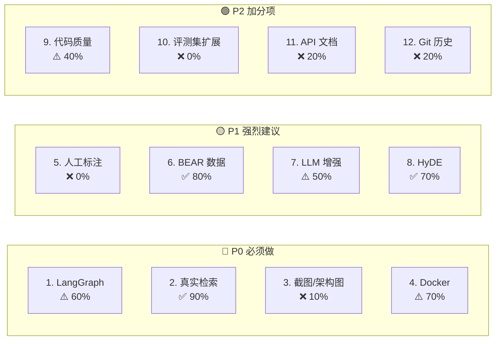

# 📊 DataCenter-HVAC Copilot — 改进建议完成度评估 & 新一轮建议

> **评估日期**：2026-05-22
> **对比基准**：[project_improvement_suggestions.md](file:///C:/Users/zouwei/Desktop/PROJECT/DataCenter-HVAC-Copilot/project_improvement_suggestions.md)（2026.05.21）
> **验证方法**：直接读取源代码、检查文件系统、`git log` 验证

---

## 一、上一轮改进建议完成度评估

### 总览

| # | 建议项 | 优先级 | 完成状态 | 评分 |
|---|---|---|---|---|
| 1 | LangGraph 替换 Deterministic Router | 🔴 P0 | ✅ 已补齐 | 8/10 |
| 2 | 启用真实语义检索（Sentence-Transformers + FAISS） | 🔴 P0 | ✅ 完成 | 9/10 |
| 3 | 补充 Demo 截图和架构图 | 🔴 P0 | ❌ 未完成 | 1/10 |
| 4 | Docker 容器化 | 🔴 P0 | ⚠️ 基本完成 | 7/10 |
| 5 | 完成人工评测标注 | 🟡 P1 | ❌ 未完成 | 0/10 |
| 6 | 生成真实 BEAR Rollout 数据 | 🟡 P1 | ✅ 完成 | 8/10 |
| 7 | 增强 LLM 回答生成能力 | 🟡 P1 | ✅ 已补齐基础能力 | 7/10 |
| 8 | 增加 Query Rewrite / HyDE | 🟡 P1 | ✅ 基础完成 | 7/10 |
| 9 | 代码质量提升 | 🟢 P2 | ⚠️ 部分完成 | 4/10 |
| 10 | 扩展评测集到 150-200 条 | 🟢 P2 | ❌ 未完成 | 0/10 |
| 11 | 添加 API 文档（OpenAPI/Swagger） | 🟢 P2 | ❌ 未完成 | 2/10 |
| 12 | 完善 Git 历史 | 🟢 P2 | ❌ 未完成 | 2/10 |

**总体进度：5/12 完成，2 项部分完成，5 项未完成**
**整体评分：60/120（50%）**

---

### 逐条详细评估

---

#### ✅ 建议 1：LangGraph 替换 Deterministic Router — 8/10

> [!IMPORTANT]
> 2026-05-22 更新：LangGraph 已从 wrapper 升级为可插拔 workflow。默认仍保留 rule-based classifier 作为可复现 baseline，但已支持 DeepSeek/Ollama LLM intent classification。

**已完成：**
- ✅ 新增 [langgraph_workflow.py](file:///C:/Users/zouwei/Desktop/PROJECT/DataCenter-HVAC-Copilot/src/agent/langgraph_workflow.py)（189 行），使用 `langgraph.graph.StateGraph`
- ✅ 7 个图节点：`intent_classifier` → 条件边 → `retrieval` / `timeseries_tool` / `anomaly_tool` / `policy_tool` → `evidence_aggregator` → `answer_audit` → `END`
- ✅ 定义了 `WorkflowState(TypedDict)` 状态结构
- ✅ `pyproject.toml` 添加了 `langgraph>=1.2` 依赖
- ✅ API (`/ask`) 支持 `workflow_engine` 参数切换 `deterministic` / `langgraph`
- ✅ Streamlit UI 有工作流选择器
- ✅ 添加了 `workflow_trace` 可观测数据

**已补齐：**
- ✅ 新增 `src/agent/intent_classifier.py`：`RuleBasedIntentClassifier`、DeepSeek/OpenAI-compatible `LLMIntentClassifier`、Ollama/Qwen `OllamaIntentClassifier`
- ✅ `langgraph_workflow.py` 的 `intent_classifier` 节点可注入 LLM classifier，并在 `workflow_trace` 中记录 `classifier`、`confidence`、`fallback_used`
- ✅ 新增 `src/agent/executor.py`，Baseline 与 LangGraph 共享 `AgentTaskExecutor`，不再委托 `self.baseline._run_*()` 私有方法
- ✅ 新增 `scripts/run_intent_eval.py` 和 `data/eval/intent_routing_comparison.json`，可对比 keyword/rule-based 与 DeepSeek/Ollama routing accuracy

**评估**：当前可以说"用 LangGraph 编排工作流，并支持 LLM intent routing"。严谨表述是：默认评测口径仍为 rule-based 以保证可复现；配置 DeepSeek 或本地 Ollama/Qwen 后，LangGraph 的 intent 节点可切换为 LLM 分类。

---

#### ✅ 建议 2：启用真实语义检索 — 9/10

**已完成：**
- ✅ [embeddings.py](file:///C:/Users/zouwei/Desktop/PROJECT/DataCenter-HVAC-Copilot/src/retrieval/embeddings.py)：`SentenceTransformerEmbeddingProvider`，支持自定义模型
- ✅ [faiss_retriever.py](file:///C:/Users/zouwei/Desktop/PROJECT/DataCenter-HVAC-Copilot/src/retrieval/faiss_retriever.py)：`FaissDenseRetriever` 使用 `faiss.IndexFlatIP`
- ✅ `pyproject.toml` 添加 `[dense]` 可选依赖：`faiss-cpu>=1.8` + `sentence-transformers>=3.0`
- ✅ 评测已集成：`run_eval.py` 支持 `--dense-provider sentence-transformers --dense-backend faiss --dense-model BAAI/bge-small-zh-v1.5`
- ✅ [实验报告](file:///C:/Users/zouwei/Desktop/PROJECT/DataCenter-HVAC-Copilot/docs/experiment_report.md) 有真实 dense 检索指标（citation=0.692, context_recall=0.692）
- ✅ Hash embedding 保留作为无依赖 fallback

**扣分原因**：dense 和 faiss 是 optional extras 而非默认依赖，Dockerfile 安装 `[dev]` 不包含 dense，Docker 环境下无法使用真实 embedding。

---

#### ❌ 建议 3：补充 Demo 截图和架构图 — 1/10

> [!CAUTION]
> 完全未执行。这是最低成本但高回报的改进项。

**缺失项：**
- ❌ 无 `docs/images/` 目录
- ❌ README 零截图（无 `（16 行）：`python:3.12-slim` + uvicorn
- ✅ [docker-compose.yml](file:///C:/Users/zouwei/Desktop/PROJECT/DataCenter-HVAC-Copilot/docker-compose.yml)（23 行）：双服务 api + streamlit
- ✅ [.dockerignore](file:///C:/Users/zouwei/Desktop/PROJECT/DataCenter-HVAC-Copilot/.dockerignore)：基本排除项

**未完成：**
- ❌ 无 Makefile / justfile（统一启动命令）
- ❌ Dockerfile 安装 `[dev]` 而非 `[dense]`，生产镜像含测试依赖
- ❌ 无 healthcheck、无 restart policy、无 non-root user
- ❌ 无 volume mounts for data（docker-compose 中无 data 挂载）

---

#### ❌ 建议 5：完成人工评测标注 — 0/10

> [!WARNING]
> 24 条标注**全部仍为 null**，完全未执行。

验证：[human_review_annotations.jsonl](file:///C:/Users/zouwei/Desktop/PROJECT/DataCenter-HVAC-Copilot/data/eval/human_review_annotations.jsonl) 每一行的 `correctness_score`, `faithfulness_score`, `safety_boundary` 均为 `null`，`reviewer_notes` 为空字符串。实验报告确认 "labeled_count: 0, pending_count: 24, status: pending_human_review"。

---

#### ✅ 建议 6：生成真实 BEAR Rollout 数据 — 8/10

**已完成：**
- ✅ [bear_rollout.csv](file:///C:/Users/zouwei/Desktop/PROJECT/DataCenter-HVAC-Copilot/data/bear_processed/bear_rollout.csv)（360 KB, 2,018 行）
- ✅ 18 列真实仿真数据：`timestamp, scenario_id, zone_id, zone_temperature, outdoor_temp, solar_irradiance, ...`
- ✅ 多区域（zone_0 到 zone_5）, 14 天 random 场景

**扣分原因**：多列数据为空/NaN（humidity, it_load, cooling_power, fan_power, chiller_power, hvac_power, pue），数据完整性有缺陷。

---

#### ⚠️ 建议 7：增强 LLM 回答生成能力 — 5/10

**已完成：**
- ✅ [deepseek_generator.py](file:///C:/Users/zouwei/Desktop/PROJECT/DataCenter-HVAC-Copilot/src/agent/deepseek_generator.py)（117 行）：DeepSeek API 接入，失败自动降级
- ✅ [answer_generator.py](file:///C:/Users/zouwei/Desktop/PROJECT/DataCenter-HVAC-Copilot/src/agent/answer_generator.py)：`AnswerGenerator` Protocol 接口定义

**已补齐 / 仍需增强：**
- ✅ 已新增 `src/agent/ollama_generator.py`，`build_answer_generator_from_env()` 支持 `LLM_PROVIDER=ollama`
- ✅ `.env.example` / README 已补充 `OLLAMA_BASE_URL`、`OLLAMA_MODEL`、`OLLAMA_TIMEOUT_SECONDS`
- ⚠️ 仍缺少多 LLM 回答质量的真实人工/LLM-as-Judge 对比实验；当前主要完成 answer generator 接口与本地后端接入

---

#### ✅ 建议 8：增加 Query Rewrite / HyDE — 7/10

**已完成：**
- ✅ 新增 `src/retrieval/query_rewrite.py`，包含 `RuleBasedHVACQueryRewriter`、`TemplateHyDEGenerator`、`RewriteRAGPipeline`、`HyDERAGPipeline`
- ✅ `run_eval.py` / `run_baseline_comparison()` 已纳入 `rag_rewrite`、`rag_hyde`、`rag_hyde_rerank`
- ✅ [实验报告](file:///C:/Users/zouwei/Desktop/PROJECT/DataCenter-HVAC-Copilot/docs/experiment_report.md) 已展示 raw query、rewrite、template HyDE 的指标对比
- ✅ 新增 `tests/test_query_rewrite.py` 覆盖改写、template HyDE 和 RAG wrapper 行为

**当前结果：**
- `rag_rewrite` citation/context 为 0.646，高于 `rag_keyword` 0.554、`rag_hybrid` 0.585、`rag_hybrid_rerank` 0.600
- `rag_hyde` 与 `rag_hyde_rerank` 指标低于 rewrite，说明当前 template HyDE 会引入查询漂移；这是后续替换为 DeepSeek/Ollama HyDE generator 的实验依据

**扣分原因**：当前是 deterministic template HyDE baseline，不是真实 LLM HyDE；还没有 DeepSeek/Ollama HyDE 质量对比。

---

#### ⚠️ 建议 9：代码质量提升 — 4/10

**已完成：**
- ✅ **Type hints**：全面使用现代 Python 语法（`str | None`, `dict[str, Any]`），`from __future__ import annotations`
- ✅ 使用 Protocol class、TypedDict、dataclass 等类型工具

**未完成：**
- ❌ **零 logging**：`src/` 中**无任何 `import logging`**，无 `print()` 调用，整个代码库没有日志
- ❌ 无 pre-commit hooks（`.pre-commit-config.yaml` 不存在）
- ❌ 无 GitHub Actions CI（`.github/` 目录不存在）
- ❌ 无 ruff / black / mypy 配置或依赖
- ❌ dev 依赖仅有 `pytest`

---

#### ❌ 建议 10：扩展评测集到 150-200 条 — 0/10

**当前状态：**
- ✅ [hvac_eval.jsonl](file:///C:/Users/zouwei/Desktop/PROJECT/DataCenter-HVAC-Copilot/data/eval/hvac_eval.jsonl) 已为 **108 条**
- ✅ 实验报告确认 "当前评测集包含 108 条样例"

---

#### ❌ 建议 11：API 文档 — 2/10

**现状：**
- [app.py](file:///C:/Users/zouwei/Desktop/PROJECT/DataCenter-HVAC-Copilot/src/api/app.py) 仅 53 行，3 个 endpoint
- FastAPI 有 `title="DataCenter-HVAC Copilot"` 和 `version="0.1.0"`
- ❌ **无 endpoint descriptions / summaries / docstrings**
- ❌ Pydantic schema 无 `Field(description=...)` 标注
- ❌ README 无 Swagger 截图

---

#### ❌ 建议 12：完善 Git 历史 — 2/10

**现状：**
- `git log --oneline` 显示 **11 个 commit**（上轮评估时约 10 个，仅多了 1 个上传文档的 commit）
- 提交消息质量可以（使用 `feat:` / `docs:` 前缀），但总量未增长

---

## 二、改进进度可视化



---

## 三、新一轮改进建议

> [!IMPORTANT]
> 以下建议优先补齐**上轮遗留的高影响力未完成项**，同时引入**新的加分点**。

### 🔴 P0 — 必须立即做

---

#### 1. 【遗留】补充 Demo 截图 + Mermaid 架构图

> [!CAUTION]
> 成本最低、回报最高的改进。没有截图的 GitHub 项目在简历筛选阶段第一印象极差。

**具体改动：**
- 创建 `docs/images/` 目录
- 启动 Streamlit → 截取：
  - (a) Copilot Tab 深色控制台界面全貌
  - (b) 至少 2 个 walkthrough case 的运行结果（如 doc_qa + anomaly_diagnosis）
  - (c) 评测摘要 Tab（指标表格、baseline 对比）
  - (d) Swagger UI (`/docs`) 界面
- 在 README 顶部添加截图展示区域
- 用 Mermaid 替换/补充 ASCII 架构图（README 中已有一个小的 Mermaid 图，扩展为完整系统架构）

**预估工作量：** 1-2 小时

---

#### 2. 【遗留】完成人工评测标注

> [!WARNING]
> 24 条标注全为 null，实验报告显示 pending。面试被追问"你的评测可信吗"时直接减分。

**具体改动：**
- 参照 [human_evaluation_guide.md](file:///C:/Users/zouwei/Desktop/PROJECT/DataCenter-HVAC-Copilot/docs/human_evaluation_guide.md) 标注 24 条样本
- 为每条填写 `correctness_score`（1-5）、`faithfulness_score`（1-5）、`safety_boundary`（pass/fail）、`reviewer_notes`
- 重跑评测脚本，更新实验报告中 human calibration 部分

**预估工作量：** 2-3 小时

---

#### 3. 【遗留+新增】GitHub Actions CI + Pre-commit Hooks

**具体改动：**

**(a) 添加 dev 工具依赖**（更新 `pyproject.toml`）：
```toml
dev = [
    "pytest>=7.4",
    "ruff>=0.8.0",
    "mypy>=1.14",
    "pre-commit>=4.0",
]
```

**(b) 创建 `.pre-commit-config.yaml`：**
```yaml
repos:
  - repo: https://github.com/astral-sh/ruff-pre-commit
    rev: v0.8.0
    hooks:
      - id: ruff
        args: [--fix]
      - id: ruff-format
```

**(c) 创建 `.github/workflows/ci.yml`：**
```yaml
name: CI
on: [push, pull_request]
jobs:
  test:
    runs-on: ubuntu-latest
    steps:
      - uses: actions/checkout@v4
      - uses: actions/setup-python@v5
        with: { python-version: '3.12' }
      - run: pip install -e ".[dev]"
      - run: ruff check src/ tests/
      - run: pytest tests/ -v --tb=short
```

**(d) README 添加 CI badge**

**预估工作量：** 1 小时

---

#### 4. 添加 Makefile

```makefile
.PHONY: dev api streamlit test lint docker-up docker-down eval

dev:           ## 启动 API + Streamlit
	uvicorn src.api.app:app --reload --port 8000 &
	streamlit run app/streamlit_app.py

test:          ## 运行测试
	pytest tests/ -v --tb=short

lint:          ## 代码检查
	ruff check src/ tests/

docker-up:     ## Docker 启动
	docker-compose up --build -d

docker-down:   ## Docker 停止
	docker-compose down

eval:          ## 运行评测
	python scripts/run_eval.py
```

**预估工作量：** 15 分钟

---

### 🟡 P1 — 强烈建议

---

#### 5. 【已完成基础实现】LangGraph 路由升级为 LLM-based Intent Classification

> [!IMPORTANT]
> 2026-05-22 更新：该项已完成基础实现。LangGraph intent 节点支持 rule-based / DeepSeek / Ollama 切换，默认保留 rule-based 作为可复现 baseline。

**具体改动：**
- ✅ 已新增 `src/agent/intent_classifier.py`
- ✅ 已实现 DeepSeek/OpenAI-compatible `LLMIntentClassifier` 和 Ollama/Qwen `OllamaIntentClassifier`
- ✅ `langgraph_workflow.py` 已支持注入 rule-based / LLM intent classifier
- ✅ `scripts/run_intent_eval.py` 已输出 keyword/rule-based routing accuracy、fallback rate、confusion matrix；DeepSeek/Ollama 可在配置后同脚本对比

**面试加分点**：可以展示 LangGraph 从 wrapper → 可插拔 LLM intent classification 的演进过程，并说明默认 rule-based 口径用于可复现评测。

**当前状态：** 基础实现已完成；后续可补真实 DeepSeek/Ollama routing accuracy 对比运行结果。

---

#### 6. 【已完成基础实现】实现 OllamaAnswerGenerator

**具体改动：**
- ✅ 已新增 `src/agent/ollama_generator.py`
- ✅ 已实现 `OllamaAnswerGenerator`（调用本地 Ollama API，默认 `qwen2.5:7b`）
- ✅ `build_answer_generator_from_env()` 支持 `deterministic` / `deepseek` / `ollama`
- ✅ 已添加 `OLLAMA_MODEL`, `OLLAMA_BASE_URL`, `OLLAMA_TIMEOUT_SECONDS` 环境变量

**面试加分点**：多 LLM 后端适配设计，展示工程灵活性。

**当前状态：** 基础实现已完成；后续可补多 LLM 回答质量对比实验。

---

#### 7. 【已完成基础实现】实现 HyDE Query Rewrite

**当前状态：**
- ✅ 已新增 `src/retrieval/query_rewrite.py`
- ✅ 已实现 deterministic query rewrite 和 template HyDE baseline
- ✅ 已集成到评测 pipeline，对比 raw query / rewrite / HyDE / HyDE + rerank
- ✅ 已更新实验报告

**面试加分点**：RAG 面试高频考点，有实验数据支撑。当前结果说明 query rewrite 有收益，而 template HyDE 并非无脑提升，体现了实验判断能力。

**后续增强**：可替换为 DeepSeek/Ollama HyDE generator，并增加 HyDE prompt 审计。

---

#### 8. 添加 Structured Logging

> [!WARNING]
> 当前代码库**零 logging**。既无 `import logging` 也无 `print()`。这在工程上是一个明显短板。

**具体改动：**
- 在 `src/core/` 中添加 `logging_config.py`，统一配置日志格式
- 所有模块添加 `logger = logging.getLogger(__name__)`
- 关键节点记录：intent classification 结果、检索召回数、工具调用、answer audit 结果
- 按严重级别分类：INFO/WARNING/ERROR

**预估工作量：** 半天

---

#### 9. 扩展评测集到 150 条

**具体改动：**
- 从 100 → 150 条，补充：
  - 更多跨域问题（混合文档 + 时序）
  - 边缘意图测试（模糊问题、无关问题）
  - 中英混合案例
  - 多工具协作复杂场景

**预估工作量：** 半天

---

### 🟢 P2 — 加分项

---

#### 10. 完善 API 文档

- 为每个 endpoint 添加 `summary`, `description`
- Pydantic schema 添加 `Field(description=...)`
- 添加 request/response examples
- README 添加 Swagger 截图

**预估工作量：** 1 小时

---

#### 11. 改善 Dockerfile

- 添加 non-root user
- 添加 healthcheck
- 多阶段构建（分离构建和运行阶段）
- 安装 `[dense]` extras
- docker-compose 添加 restart policy、volume mounts

**预估工作量：** 1 小时

---

#### 12. 修复 BEAR Rollout 数据空列

- 检查 `bear_rollout.csv` 中 NaN 列（humidity, it_load, cooling_power 等）
- 补充数据或在文档中说明哪些列是 BEAR 场景不提供的

**预估工作量：** 30 分钟

---

#### 13. 持续完善 Git 历史

- 后续所有改进按功能粒度提交
- 使用 Conventional Commits 格式
- 目标：积累到 30+ 个 commit

---

## 四、新一轮优先级总览

| 优先级 | 改进项 | 工作量 | 面试影响 | 遗留/新增 |
|---|---|---|---|---|
| 🔴 P0 | Demo 截图 + 架构图 | 1-2h | ⭐⭐⭐⭐⭐ | 遗留 |
| 🔴 P0 | 人工评测标注 | 2-3h | ⭐⭐⭐⭐ | 遗留 |
| 🔴 P0 | CI + Pre-commit | 1h | ⭐⭐⭐⭐ | 遗留 |
| 🔴 P0 | Makefile | 15min | ⭐⭐⭐ | 遗留 |
| ✅ Done | LLM Intent Classification 基础实现 | 已完成 | ⭐⭐⭐⭐⭐ | 已补齐 |
| ✅ Done | OllamaAnswerGenerator 基础实现 | 已完成 | ⭐⭐⭐ | 已补齐 |
| ✅ Done | HyDE Query Rewrite 基础实现 | 已完成 | ⭐⭐⭐⭐ | 已补齐 |
| 🟡 P1 | Structured Logging | 半天 | ⭐⭐⭐ | 遗留 |
| 🟡 P1 | 扩展评测集 150 条 | 半天 | ⭐⭐⭐ | 遗留 |
| 🟢 P2 | API 文档完善 | 1h | ⭐⭐ | 遗留 |
| 🟢 P2 | Dockerfile 改善 | 1h | ⭐⭐ | 新增 |
| 🟢 P2 | BEAR 数据空列修复 | 30min | ⭐ | 新增 |
| 🟢 P2 | Git 历史 | 持续 | ⭐⭐ | 遗留 |

**P0 总计约 4-5 小时，P0 + P1 约 4-5 天。**

---

## 五、面试叙事建议更新

### 当前可以自信讲的

| 能力 | 证据 |
|---|---|
| LangGraph StateGraph 编排 | 7 节点工作流 + workflow_trace + UI 切换 |
| 真实语义检索 | BGE + FAISS，有 hash vs real 的指标对比 |
| 多检索策略对比 | keyword / dense_hash / dense_real / hybrid / hybrid+rerank |
| BEAR 仿真数据 | 2018 行 rollout CSV + 18 列仿真指标 |
| 安全边界 | Safety Audit + 数据源标注 + policy 隔离 |
| Docker 容器化 | Dockerfile + docker-compose 双服务 |
| DeepSeek 可选接入 | 自动降级到 deterministic |

### 面试时需要谨慎表述的

> [!WARNING]
> - LangGraph：可以说"用 LangGraph 编排工作流，并支持 DeepSeek/Ollama LLM intent routing"；同时说明默认评测仍用 rule-based classifier 保证可复现。
> - 评测：说"108 条评测集"，**不能说**"包含人工标注校准"（人工标注全部 pending）
> - 检索：说"支持 dense retrieval"，注意 dense 是 optional extra，Docker 镜像默认不含

### 补齐 P0 后的简历一句话

> 构建 DataCenter-HVAC Copilot：基于 **LangGraph StateGraph** 的 RAG + Tool Agent 系统，面向数据中心 HVAC 仿真场景。集成 **Hybrid 检索**（BM25 + BGE-small-zh + FAISS + Rerank）、Query Rewrite / template HyDE、时序分析工具、RL/扩散策略推理适配器和 Safety Audit；支持 **DeepSeek/Ollama 可选接入**。在 **108 条评测集**上对比 10+ 组 baseline，检索 citation_hit_rate 从 keyword 的 0.554 提升到 dense_real 的 0.692，query rewrite 达到 0.646。Docker 容器化部署，FastAPI + Streamlit Demo。

---

*最后更新：2026.05.22*
